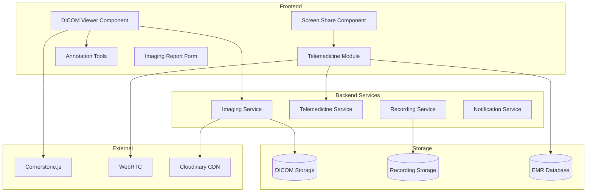
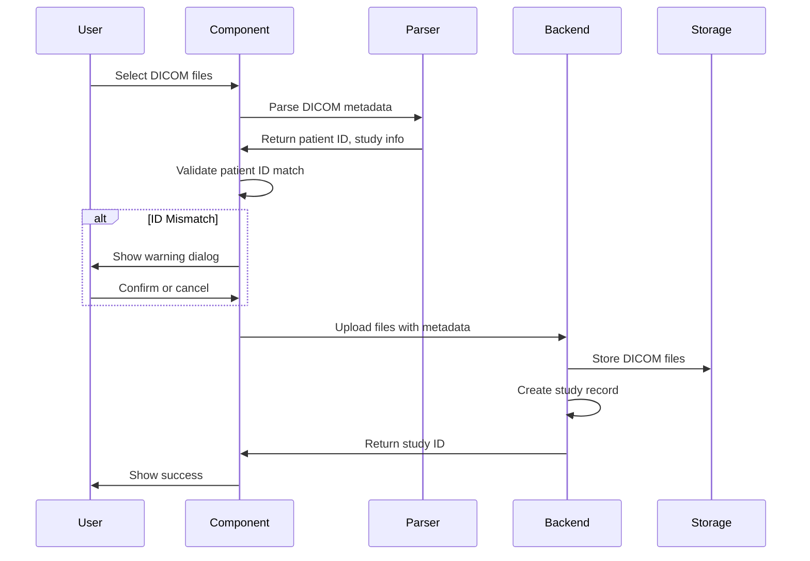
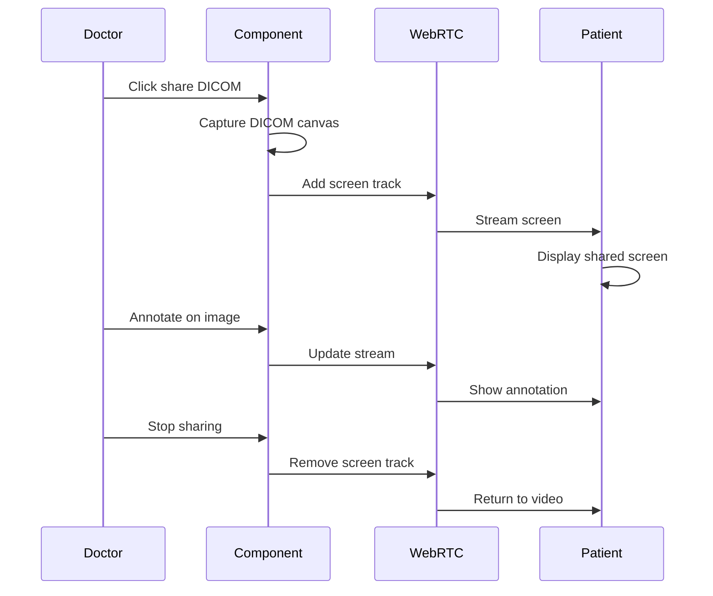

# Design Document: Advanced Imaging Features

## Overview

This design document describes the architecture and implementation of advanced imaging capabilities for the HealthSync EMR system. The features include a web-based DICOM viewer for medical imaging (X-rays, CT scans, MRIs, ultrasounds) and enhanced telemedicine with full EMR integration during video consultations.

The DICOM viewer uses Cornerstone.js, an open-source JavaScript library for medical imaging, providing diagnostic-quality viewing tools without requiring specialized software. The telemedicine module enhances the existing WebRTC-based video consultation with EMR access, screen sharing, and recording capabilities.

## Architecture



## Components and Interfaces

### 1. DICOM Viewer Component

**Purpose**: Display and manipulate medical images in DICOM format with diagnostic-quality tools.

**Location**: `frontend/src/components/emr/DicomViewer.js`

**Dependencies**:
- `@cornerstonejs/core` - Core rendering engine
- `@cornerstonejs/tools` - Measurement and annotation tools
- `@cornerstonejs/dicom-image-loader` - DICOM file parsing
- `dicom-parser` - DICOM metadata extraction

**Props**:
```javascript
{
  studyId: string,           // Study identifier
  patientId: string,         // Patient ID for validation
  visitId: string,           // Associated visit
  onAnnotationSave: (annotations) => void,
  onReportCreate: (report) => void,
  readOnly: boolean          // View-only mode
}
```

**State**:
```javascript
{
  currentStudy: {
    studyId: string,
    patientName: string,
    studyDate: Date,
    modality: string,        // CT, MR, CR, US, etc.
    bodyPart: string,
    institution: string,
    series: Array<Series>,
    totalImages: number
  },
  viewerState: {
    currentSeriesIndex: number,
    currentImageIndex: number,
    zoom: number,            // 0.25 to 4.0
    pan: { x: number, y: number },
    windowWidth: number,     // Contrast
    windowCenter: number,    // Brightness
    rotation: number,        // 0, 90, 180, 270
    flipH: boolean,
    flipV: boolean
  },
  annotations: Array<Annotation>,
  measurements: Array<Measurement>,
  layout: '1x1' | '2x1' | '1x2' | '2x2',
  syncEnabled: boolean,
  activeToolId: string
}
```

**Window/Level Presets**:
```javascript
const WINDOW_PRESETS = {
  'default': { ww: 400, wc: 40 },
  'bone': { ww: 2000, wc: 500 },
  'lung': { ww: 1500, wc: -600 },
  'soft-tissue': { ww: 350, wc: 50 },
  'brain': { ww: 80, wc: 40 },
  'liver': { ww: 150, wc: 30 },
  'abdomen': { ww: 400, wc: 50 }
};
```

### 2. DICOM Upload Component

**Purpose**: Handle DICOM file uploads with metadata extraction and patient validation.

**Location**: `frontend/src/components/emr/DicomUpload.js`

**Props**:
```javascript
{
  patientId: string,
  visitId: string,
  onUploadComplete: (study) => void,
  onError: (error) => void
}
```

**Upload Flow**:


### 3. Annotation Tools Component

**Purpose**: Provide measurement and annotation capabilities for medical images.

**Location**: `frontend/src/components/emr/AnnotationTools.js`

**Available Tools**:
| Tool | Description | Output |
|------|-------------|--------|
| Length | Line measurement | Distance in mm |
| Angle | Angle measurement | Degrees |
| Rectangle ROI | Rectangular region | Area, mean HU |
| Ellipse ROI | Elliptical region | Area, mean HU |
| Freehand ROI | Custom shape | Area, mean HU |
| Arrow | Pointer annotation | Position |
| Text | Text label | Text content |
| Probe | Point measurement | HU value |

**Annotation Data Structure**:
```javascript
{
  id: string,
  toolType: string,
  imageId: string,
  seriesId: string,
  studyId: string,
  data: {
    handles: Array<{ x: number, y: number }>,
    text: string,
    measurement: {
      value: number,
      unit: string
    }
  },
  createdBy: string,
  createdAt: Date,
  color: string,
  visible: boolean
}
```

### 4. Multi-Panel Viewer Component

**Purpose**: Display multiple images side-by-side for comparison.

**Location**: `frontend/src/components/emr/MultiPanelViewer.js`

**Props**:
```javascript
{
  layout: '1x1' | '2x1' | '1x2' | '2x2',
  studies: Array<Study>,
  syncZoom: boolean,
  syncPan: boolean,
  syncWindowLevel: boolean,
  syncScroll: boolean
}
```

**Synchronization Logic**:
```javascript
// When sync is enabled, changes propagate to all panels
const handleViewerChange = (panelIndex, change) => {
  if (syncEnabled) {
    panels.forEach((panel, idx) => {
      if (idx !== panelIndex) {
        applyChange(panel, change);
      }
    });
  }
};
```

### 5. Enhanced Telemedicine Component

**Purpose**: Video consultation with integrated EMR access and screen sharing.

**Location**: `frontend/src/components/emr/TelemedicineConsultation.js`

**Enhancements over existing VideoConsultation**:
- EMR sidebar with patient summary
- Screen sharing for DICOM viewer
- Real-time annotation during screen share
- Consultation recording with consent
- Connection quality monitoring

**Props**:
```javascript
{
  appointmentId: string,
  patientId: string,
  user: User,
  userType: 'doctor' | 'patient',
  onClose: () => void,
  onVisitCreate: (visit) => void
}
```

**State**:
```javascript
{
  // Video state (inherited from VideoConsultation)
  localStream: MediaStream,
  remoteStream: MediaStream,
  isAudioEnabled: boolean,
  isVideoEnabled: boolean,
  connectionQuality: 'excellent' | 'good' | 'fair' | 'poor',
  
  // EMR integration
  showEMRSidebar: boolean,
  patientSummary: PatientSummary,
  activeEMRTab: 'summary' | 'vitals' | 'labs' | 'history' | 'notes',
  consultationNotes: string,
  
  // Screen sharing
  isScreenSharing: boolean,
  screenStream: MediaStream,
  sharedContent: 'dicom' | 'document' | 'screen',
  
  // Recording
  isRecording: boolean,
  recordingConsent: { doctor: boolean, patient: boolean },
  recordingStartTime: Date
}
```

### 6. Screen Share Component

**Purpose**: Share DICOM viewer or documents during consultation.

**Location**: `frontend/src/components/emr/ScreenShare.js`

**Screen Share Flow**:


### 7. Imaging Report Component

**Purpose**: Create structured radiology reports linked to studies.

**Location**: `frontend/src/components/emr/ImagingReport.js`

**Report Template Structure**:
```javascript
{
  studyId: string,
  patientId: string,
  reportType: 'preliminary' | 'final' | 'addendum',
  
  clinicalHistory: string,
  technique: string,
  comparison: string,        // Prior studies compared
  
  findings: string,          // Detailed observations
  impression: string,        // Summary/diagnosis
  recommendations: string,   // Follow-up suggestions
  
  keyImages: Array<{
    imageId: string,
    caption: string,
    annotations: Array<string>
  }>,
  
  reportedBy: string,
  reportedAt: Date,
  verifiedBy: string,
  verifiedAt: Date,
  
  status: 'draft' | 'preliminary' | 'final'
}
```

## Data Models

### DICOM Study Model

**Location**: `backend/models/DicomStudy.js`

```javascript
const dicomStudySchema = new mongoose.Schema({
  patientId: { type: ObjectId, ref: 'User', required: true },
  clinicId: { type: ObjectId, ref: 'Clinic', required: true },
  visitId: { type: ObjectId, ref: 'EMRVisit' },
  
  // DICOM UIDs
  studyInstanceUID: { type: String, required: true, unique: true },
  accessionNumber: String,
  
  // Study Information
  studyDate: { type: Date, required: true },
  studyTime: String,
  studyDescription: String,
  
  // Patient Info (from DICOM)
  dicomPatientId: String,
  dicomPatientName: String,
  patientBirthDate: Date,
  patientSex: String,
  
  // Modality and Body Part
  modality: { 
    type: String, 
    enum: ['CR', 'CT', 'MR', 'US', 'XA', 'NM', 'PT', 'DX', 'MG', 'OT'],
    required: true 
  },
  bodyPartExamined: String,
  
  // Institution
  institutionName: String,
  referringPhysician: String,
  
  // Series
  series: [{
    seriesInstanceUID: { type: String, required: true },
    seriesNumber: Number,
    seriesDescription: String,
    modality: String,
    numberOfImages: Number,
    images: [{
      sopInstanceUID: { type: String, required: true },
      instanceNumber: Number,
      imageUrl: String,           // Cloudinary URL
      thumbnailUrl: String,
      rows: Number,
      columns: Number,
      bitsAllocated: Number,
      windowCenter: Number,
      windowWidth: Number
    }]
  }],
  
  // Annotations
  annotations: [{
    annotationId: String,
    imageSOPUID: String,
    toolType: String,
    data: mongoose.Schema.Types.Mixed,
    createdBy: { type: ObjectId, ref: 'User' },
    createdAt: { type: Date, default: Date.now }
  }],
  
  // Reports
  reports: [{
    reportId: String,
    reportType: { type: String, enum: ['preliminary', 'final', 'addendum'] },
    findings: String,
    impression: String,
    recommendations: String,
    keyImages: [String],
    reportedBy: { type: ObjectId, ref: 'Doctor' },
    reportedAt: Date,
    status: { type: String, enum: ['draft', 'preliminary', 'final'] }
  }],
  
  // Metadata
  totalImages: Number,
  totalSeries: Number,
  storageSize: Number,          // Bytes
  uploadedBy: { type: ObjectId, ref: 'User' },
  uploadedAt: { type: Date, default: Date.now }
}, { timestamps: true });

// Indexes
dicomStudySchema.index({ patientId: 1, studyDate: -1 });
dicomStudySchema.index({ studyInstanceUID: 1 });
dicomStudySchema.index({ clinicId: 1, modality: 1 });
```

### Telemedicine Session Model

**Location**: `backend/models/TelemedicineSession.js`

```javascript
const telemedicineSessionSchema = new mongoose.Schema({
  appointmentId: { type: ObjectId, ref: 'Appointment', required: true },
  visitId: { type: ObjectId, ref: 'EMRVisit' },
  patientId: { type: ObjectId, ref: 'User', required: true },
  doctorId: { type: ObjectId, ref: 'Doctor', required: true },
  clinicId: { type: ObjectId, ref: 'Clinic', required: true },
  
  // Session timing
  scheduledStart: { type: Date, required: true },
  actualStart: Date,
  actualEnd: Date,
  duration: Number,             // Seconds
  
  // Connection details
  roomId: { type: String, required: true, unique: true },
  connectionQuality: {
    average: String,            // excellent, good, fair, poor
    issues: [String]
  },
  
  // Participants
  participants: [{
    odId: { type: ObjectId, ref: 'User' },
    role: { type: String, enum: ['doctor', 'patient'] },
    joinedAt: Date,
    leftAt: Date,
    deviceInfo: String
  }],
  
  // Recording
  recording: {
    enabled: Boolean,
    consentDoctor: { type: Boolean, default: false },
    consentPatient: { type: Boolean, default: false },
    recordingUrl: String,
    recordingSize: Number,
    recordingDuration: Number
  },
  
  // Screen sharing events
  screenShares: [{
    startedAt: Date,
    endedAt: Date,
    sharedBy: { type: ObjectId, ref: 'User' },
    contentType: { type: String, enum: ['dicom', 'document', 'screen'] }
  }],
  
  // EMR actions during session
  emrActions: [{
    action: String,             // viewed_vitals, created_prescription, etc.
    timestamp: Date,
    details: mongoose.Schema.Types.Mixed
  }],
  
  // Session status
  status: {
    type: String,
    enum: ['scheduled', 'waiting', 'in_progress', 'completed', 'cancelled', 'no_show'],
    default: 'scheduled'
  },
  
  // Notes
  consultationNotes: String,
  technicalNotes: String
}, { timestamps: true });
```

## API Endpoints

### DICOM API

```
POST   /api/imaging/upload              - Upload DICOM files
GET    /api/imaging/studies/:studyId    - Get study details
GET    /api/imaging/patients/:patientId/studies - Get patient's imaging history
GET    /api/imaging/studies/:studyId/images/:imageId - Get image data
POST   /api/imaging/studies/:studyId/annotations - Save annotations
GET    /api/imaging/studies/:studyId/annotations - Get annotations
POST   /api/imaging/studies/:studyId/reports - Create imaging report
PUT    /api/imaging/reports/:reportId   - Update report
GET    /api/imaging/reports/:reportId/pdf - Generate PDF report
```

### Telemedicine API

```
POST   /api/telemedicine/sessions       - Create session
GET    /api/telemedicine/sessions/:id   - Get session details
PUT    /api/telemedicine/sessions/:id/start - Start session
PUT    /api/telemedicine/sessions/:id/end - End session
POST   /api/telemedicine/sessions/:id/consent - Record consent
POST   /api/telemedicine/sessions/:id/recording/start - Start recording
POST   /api/telemedicine/sessions/:id/recording/stop - Stop recording
GET    /api/telemedicine/sessions/:id/recording - Get recording
POST   /api/telemedicine/sessions/:id/screen-share - Log screen share
GET    /api/telemedicine/patients/:patientId/sessions - Get patient sessions
```


## Correctness Properties

*A property is a characteristic or behavior that should hold true across all valid executions of a system—essentially, a formal statement about what the system should do. Properties serve as the bridge between human-readable specifications and machine-verifiable correctness guarantees.*

### Property 1: DICOM Format Validation

*For any* file submitted for upload, the system SHALL accept it if and only if it has a valid DICOM format (.dcm, .dicom extension or valid DICOM directory structure with DICOMDIR).

**Validates: Requirements 1.1**

### Property 2: DICOM Metadata Extraction Accuracy

*For any* valid DICOM file with embedded metadata, extracting patient ID, study date, modality, body part, patient name, and institution SHALL produce values that exactly match the DICOM header fields, and these values SHALL be correctly auto-populated in imaging reports.

**Validates: Requirements 1.2, 10.2**

### Property 3: Patient ID Validation

*For any* DICOM upload where the DICOM patient ID differs from the selected patient record ID, the system SHALL flag this as a mismatch and require explicit confirmation before proceeding.

**Validates: Requirements 1.3**

### Property 4: Study-Patient-Visit Linking Integrity

*For any* stored DICOM study, annotation, or imaging report, the record SHALL contain valid references to the patient ID, and optionally the visit ID, such that querying by patient returns all associated imaging data.

**Validates: Requirements 1.5, 3.5, 10.3**

### Property 5: Image Rendering Dimensions

*For any* DICOM image with rows R and columns C in its metadata, the rendered image SHALL have dimensions proportional to R×C maintaining the correct aspect ratio.

**Validates: Requirements 2.1**

### Property 6: Zoom Range Validation

*For any* zoom operation, the resulting zoom level SHALL be within the valid range [0.25, 4.0], and zoom values outside this range SHALL be clamped to the nearest boundary.

**Validates: Requirements 2.2**

### Property 7: Window/Level Application

*For any* window width W and window center C applied to an image, the displayed pixel values SHALL be transformed according to the standard DICOM window/level formula, and preset values for tissue types SHALL produce consistent results.

**Validates: Requirements 2.4**

### Property 8: Slice Navigation Bounds

*For any* CT or MRI study with N slices, navigating to slice index I SHALL result in displaying slice max(0, min(I, N-1)), ensuring the index never exceeds valid bounds.

**Validates: Requirements 2.5**

### Property 9: Metadata Display Correctness

*For any* displayed DICOM study, the shown patient name, study date, modality, and institution SHALL exactly match the values stored in the study record.

**Validates: Requirements 2.6**

### Property 10: Distance Measurement Accuracy

*For any* line measurement between two points (x1,y1) and (x2,y2) on an image with pixel spacing S mm/pixel, the calculated distance SHALL equal sqrt((x2-x1)² + (y2-y1)²) × S within 0.1mm precision.

**Validates: Requirements 3.1**

### Property 11: Angle Measurement Accuracy

*For any* angle measurement defined by three points A, B, C, the calculated angle at vertex B SHALL equal the geometric angle ABC within 0.1 degree precision.

**Validates: Requirements 3.2**

### Property 12: Area Measurement Accuracy

*For any* rectangular ROI with width W and height H pixels on an image with pixel spacing S mm/pixel, the calculated area SHALL equal W × H × S² within 1mm² precision.

**Validates: Requirements 3.3**

### Property 13: Export Includes Annotations

*For any* image export where annotations exist, the exported file SHALL contain all annotation data such that re-importing produces equivalent annotations.

**Validates: Requirements 3.7**

### Property 14: Panel Synchronization

*For any* multi-panel view with synchronization enabled, changing zoom, pan, window/level, or slice on one panel SHALL propagate the same change to all other panels within the same synchronization group.

**Validates: Requirements 4.2, 4.3, 4.4**

### Property 15: Imaging History Retrieval

*For any* patient with N imaging studies, querying their imaging history SHALL return exactly N studies with correct study dates and modalities sorted by date descending.

**Validates: Requirements 4.5**

### Property 16: Media Toggle State

*For any* audio or video toggle operation during a consultation, the track's enabled state SHALL change to the opposite of its previous state, and the UI SHALL reflect the new state.

**Validates: Requirements 5.3**

### Property 17: Connection Quality Calculation

*For any* set of WebRTC statistics (packet loss, jitter, round-trip time), the calculated connection quality SHALL be 'excellent' if packet loss < 1% and RTT < 100ms, 'good' if packet loss < 3% and RTT < 200ms, 'fair' if packet loss < 5% and RTT < 400ms, and 'poor' otherwise.

**Validates: Requirements 5.4**

### Property 18: Session Logging Completeness

*For any* completed telemedicine session, the session log SHALL contain: start time, end time, duration (end - start), participant IDs, and the created EMR visit SHALL have consultationType set to 'telemedicine'.

**Validates: Requirements 5.6, 6.6**

### Property 19: EMR Integration During Consultation

*For any* active telemedicine session for patient P, the doctor SHALL be able to access P's vitals history, lab results, medical history, create prescriptions (with interaction checking), record notes, and order lab tests, all linked to the session's visit record.

**Validates: Requirements 6.1, 6.2, 6.3, 6.4, 6.5**

### Property 20: Screen Share State Transition

*For any* screen sharing session, stopping the share SHALL transition the state from 'sharing' to 'not_sharing' and remove the screen track from the WebRTC connection.

**Validates: Requirements 7.5**

### Property 21: Appointment Type Marking

*For any* telemedicine appointment created through the scheduling system, the appointment record SHALL have consultationType set to 'video' or 'telemedicine'.

**Validates: Requirements 8.1**

### Property 22: Notification Scheduling

*For any* scheduled telemedicine appointment at time T, the system SHALL queue notifications at T-24hours and T-15minutes containing the joining link.

**Validates: Requirements 8.2, 8.3**

### Property 23: Identity Verification Requirement

*For any* patient attempting to join a consultation, the system SHALL verify their identity (via login or OTP) before establishing the video connection with the doctor.

**Validates: Requirements 8.5**

### Property 24: Recording Consent Requirement

*For any* consultation recording to start, both doctor consent AND patient consent flags SHALL be true; recording SHALL NOT start if either consent is false.

**Validates: Requirements 9.1**

### Property 25: Recording-Visit Linking

*For any* consultation recording, the recording record SHALL contain a valid reference to the visit ID, and querying the visit SHALL return the associated recording.

**Validates: Requirements 9.3**

### Property 26: Recording Access Control

*For any* recording access attempt, the system SHALL verify the requester has appropriate permissions (doctor who conducted the session, clinic admin, or patient with consent), and SHALL log the access with requester ID and timestamp.

**Validates: Requirements 9.4**

### Property 27: Report Structure Completeness

*For any* imaging report, the report SHALL contain non-empty fields for: findings, impression, and recommendations sections, along with reportedBy and reportedAt metadata.

**Validates: Requirements 10.1**

### Property 28: Report-Study Association

*For any* study with associated reports, querying the study SHALL return all linked reports, and each report SHALL reference the correct studyId.

**Validates: Requirements 10.4**

### Property 29: PDF Export with Key Images

*For any* imaging report PDF export, the generated PDF SHALL contain the report text content and all designated key images embedded in the document.

**Validates: Requirements 10.5**

## Error Handling

### DICOM Processing Errors

| Error Type | Handling Strategy |
|------------|-------------------|
| Invalid DICOM format | Display error message, reject upload |
| Corrupted DICOM file | Log error, show partial data if possible |
| Missing required metadata | Prompt user to enter missing fields manually |
| Patient ID mismatch | Show warning dialog with mismatch details |
| Upload timeout | Offer retry with resume capability |
| Storage quota exceeded | Alert admin, prevent upload |

### Telemedicine Errors

| Error Type | Handling Strategy |
|------------|-------------------|
| Camera/mic permission denied | Show permission instructions, offer audio-only |
| WebRTC connection failed | Retry with TURN server, show troubleshooting |
| Poor connection quality | Auto-reduce video quality, notify participants |
| Participant disconnected | Show reconnection status, allow rejoin |
| Recording failed | Notify participants, continue without recording |
| Screen share failed | Fall back to file sharing |

### API Error Responses

```javascript
// Standard error response format
{
  success: false,
  error: {
    code: 'DICOM_PARSE_ERROR' | 'PATIENT_MISMATCH' | 'CONNECTION_FAILED' | 
          'PERMISSION_DENIED' | 'RECORDING_ERROR' | 'STORAGE_ERROR',
    message: string,
    details: object
  }
}
```

### Graceful Degradation

1. **DICOM Viewer Offline**: Cache recently viewed studies, show cached images
2. **WebRTC Unavailable**: Fall back to audio-only or phone consultation
3. **Recording Service Down**: Continue consultation without recording, log for later
4. **Annotation Save Failed**: Queue locally, retry when connection restored

## Testing Strategy

### Unit Tests

Unit tests focus on specific examples and edge cases:

1. **DICOM Parsing**
   - Test valid DICOM file parsing
   - Test invalid file rejection
   - Test metadata extraction accuracy

2. **Measurement Calculations**
   - Test distance calculation with known pixel spacing
   - Test angle calculation with known points
   - Test area calculation for rectangles and ellipses

3. **Window/Level**
   - Test preset values application
   - Test custom window/level calculation
   - Test boundary conditions

4. **Session Management**
   - Test session creation and state transitions
   - Test consent flag validation
   - Test duration calculation

5. **Notification Scheduling**
   - Test reminder timing calculation
   - Test notification content generation

### Property-Based Tests

Property-based tests use randomized inputs to verify universal properties. Each test runs minimum 100 iterations.

**Testing Framework**: Jest with fast-check for property-based testing

```javascript
// Example property test structure
import fc from 'fast-check';

describe('DICOM Measurement Properties', () => {
  // Feature: advanced-imaging, Property 10: Distance Measurement Accuracy
  test('distance calculation is accurate within 0.1mm', () => {
    fc.assert(
      fc.property(
        fc.float({ min: 0, max: 1000 }),  // x1
        fc.float({ min: 0, max: 1000 }),  // y1
        fc.float({ min: 0, max: 1000 }),  // x2
        fc.float({ min: 0, max: 1000 }),  // y2
        fc.float({ min: 0.1, max: 2.0 }), // pixelSpacing
        (x1, y1, x2, y2, pixelSpacing) => {
          const calculated = calculateDistance(x1, y1, x2, y2, pixelSpacing);
          const expected = Math.sqrt((x2-x1)**2 + (y2-y1)**2) * pixelSpacing;
          expect(Math.abs(calculated - expected)).toBeLessThan(0.1);
        }
      ),
      { numRuns: 100 }
    );
  });
});
```

### Integration Tests

1. **DICOM Upload Flow**: Upload file → Parse metadata → Validate patient → Store → Verify retrieval
2. **Annotation Workflow**: Create annotation → Save → Reload study → Verify annotation displayed
3. **Telemedicine Session**: Create session → Join → Access EMR → Create prescription → End → Verify visit created
4. **Recording Flow**: Start session → Get consent → Start recording → End → Verify recording stored

### Test Data Generators

```javascript
// Generators for property-based testing
const dicomGenerators = {
  pixelSpacing: fc.float({ min: 0.1, max: 2.0 }),
  point: fc.record({
    x: fc.float({ min: 0, max: 1000 }),
    y: fc.float({ min: 0, max: 1000 })
  }),
  windowLevel: fc.record({
    windowWidth: fc.integer({ min: 1, max: 4000 }),
    windowCenter: fc.integer({ min: -1000, max: 3000 })
  }),
  zoomLevel: fc.float({ min: 0.1, max: 5.0 }),
  sliceIndex: fc.integer({ min: -10, max: 500 })
};

const telemedicineGenerators = {
  connectionStats: fc.record({
    packetLoss: fc.float({ min: 0, max: 20 }),
    jitter: fc.float({ min: 0, max: 100 }),
    roundTripTime: fc.integer({ min: 10, max: 1000 })
  }),
  sessionDuration: fc.integer({ min: 60, max: 7200 }),
  consent: fc.record({
    doctor: fc.boolean(),
    patient: fc.boolean()
  })
};
```

## Subscription Tier Integration

| Feature | Basic | Standard | Advanced |
|---------|-------|----------|----------|
| DICOM Upload | - | ✓ | ✓ |
| DICOM Viewing | - | ✓ | ✓ |
| Basic Measurements | - | ✓ | ✓ |
| Advanced ROI Tools | - | - | ✓ |
| Multi-Panel Comparison | - | - | ✓ |
| Imaging Reports | - | - | ✓ |
| Telemedicine (Basic) | ✓ | ✓ | ✓ |
| EMR During Telemedicine | - | ✓ | ✓ |
| Screen Sharing | - | ✓ | ✓ |
| Consultation Recording | - | - | ✓ |

## Security Considerations

1. **DICOM Data**: PHI in DICOM headers must be handled per HIPAA requirements
2. **Video Streams**: End-to-end encryption via WebRTC SRTP
3. **Recordings**: Encrypted at rest, access logged, retention policies enforced
4. **Screen Sharing**: Only doctor can initiate, patient sees sharing indicator
5. **Identity Verification**: Required before joining consultation
