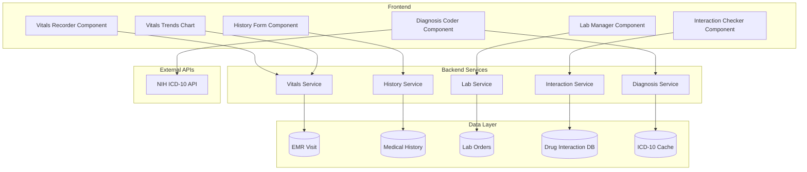

# Design Document: EMR Clinical Features

## Overview

This design document describes the architecture and implementation of enhanced clinical features for the HealthSync EMR system. The features include comprehensive vitals recording with trend analysis, lab test ordering and result tracking, structured medical history forms, ICD-10 diagnosis coding with search, and drug interaction alerts with allergy cross-checking.

The system integrates with free external APIs (NIH Clinical Tables for ICD-10, local drug interaction database) and builds upon the existing EMR subscription infrastructure, ensuring features are accessible based on subscription tier.

## Architecture



## Components and Interfaces

### 1. Vitals Recorder Component

**Purpose**: Capture and validate patient vital signs at each visit.

**Location**: `frontend/src/components/emr/VitalsRecorder.js`

**Props**:
```javascript
{
  visitId: string,           // Current visit ID
  patientId: string,         // Patient ID for history lookup
  existingVitals: object,    // Pre-populated vitals if editing
  onSave: (vitals) => void,  // Callback when vitals saved
  readOnly: boolean          // View-only mode
}
```

**State**:
```javascript
{
  vitals: {
    bloodPressure: { systolic: number, diastolic: number },
    pulse: number,
    temperature: { value: number, unit: 'F' | 'C' },
    weight: { value: number, unit: 'kg' | 'lbs' },
    height: { value: number, unit: 'cm' | 'ft' },
    spo2: number,
    bloodSugar: { value: number, type: 'fasting' | 'random' | 'postMeal' }
  },
  validationErrors: object,
  abnormalFlags: string[]
}
```

**Validation Rules**:
| Vital | Valid Range | Abnormal Threshold |
|-------|-------------|-------------------|
| BP Systolic | 60-250 mmHg | <90 or >140 |
| BP Diastolic | 40-150 mmHg | <60 or >90 |
| Pulse | 30-220 bpm | <60 or >100 |
| Temperature (F) | 95-108°F | <97 or >99.5 |
| SpO2 | 70-100% | <95% |
| Blood Sugar (fasting) | 50-500 mg/dL | <70 or >126 |

### 2. Lab Manager Component

**Purpose**: Order lab tests, track status, and attach results.

**Location**: `frontend/src/components/emr/LabManager.js`

**Props**:
```javascript
{
  visitId: string,
  patientId: string,
  clinicId: string,
  onOrderCreated: (order) => void
}
```

**Lab Test Catalog** (pre-configured):
```javascript
const LAB_TESTS = [
  { code: 'CBC', name: 'Complete Blood Count', category: 'Hematology', turnaround: '24h' },
  { code: 'LFT', name: 'Liver Function Test', category: 'Biochemistry', turnaround: '24h' },
  { code: 'KFT', name: 'Kidney Function Test', category: 'Biochemistry', turnaround: '24h' },
  { code: 'LIPID', name: 'Lipid Profile', category: 'Biochemistry', turnaround: '24h' },
  { code: 'TSH', name: 'Thyroid Stimulating Hormone', category: 'Endocrine', turnaround: '48h' },
  { code: 'HBA1C', name: 'Glycated Hemoglobin', category: 'Diabetes', turnaround: '24h' },
  { code: 'URINE', name: 'Urine Routine', category: 'Urinalysis', turnaround: '12h' },
  { code: 'XRAY', name: 'X-Ray', category: 'Radiology', turnaround: '2h' },
  { code: 'ECG', name: 'Electrocardiogram', category: 'Cardiology', turnaround: '1h' },
  // ... more tests
];
```

### 3. Medical History Form Component

**Purpose**: Capture comprehensive patient medical background.

**Location**: `frontend/src/components/emr/MedicalHistoryForm.js`

**Data Structure**:
```javascript
{
  patientId: string,
  allergies: [{
    allergen: string,
    type: 'drug' | 'food' | 'environmental' | 'other',
    severity: 'mild' | 'moderate' | 'severe' | 'life-threatening',
    reaction: string,
    diagnosedDate: Date
  }],
  chronicConditions: [{
    condition: string,
    icdCode: string,
    diagnosedDate: Date,
    status: 'active' | 'controlled' | 'resolved',
    notes: string
  }],
  familyHistory: [{
    relationship: 'father' | 'mother' | 'sibling' | 'child' | 'grandparent',
    condition: string,
    ageOfOnset: number,
    notes: string
  }],
  surgicalHistory: [{
    procedure: string,
    date: Date,
    hospital: string,
    complications: string
  }],
  currentMedications: [{
    drugName: string,
    dosage: string,
    frequency: string,
    prescribedBy: string,
    startDate: Date
  }],
  socialHistory: {
    smoking: 'never' | 'former' | 'current',
    alcohol: 'never' | 'occasional' | 'regular',
    occupation: string
  },
  lastUpdated: Date,
  updatedBy: string
}
```

### 4. Diagnosis Coder Component

**Purpose**: Search and assign ICD-10 diagnosis codes.

**Location**: `frontend/src/components/emr/DiagnosisCoder.js`

**External API Integration**:
```javascript
// NIH Clinical Tables API - Free, no license required
const ICD10_API = 'https://clinicaltables.nlm.nih.gov/api/icd10cm/v3/search';

// Search function
async function searchICD10(searchTerm) {
  const response = await fetch(
    `${ICD10_API}?sf=code,name&terms=${encodeURIComponent(searchTerm)}&maxList=20`
  );
  const [total, codes, , descriptions] = await response.json();
  return codes.map((code, i) => ({
    code,
    description: descriptions[i][1]
  }));
}
```

**Component State**:
```javascript
{
  searchTerm: string,
  searchResults: Array<{ code: string, description: string }>,
  selectedDiagnoses: Array<{
    code: string,
    description: string,
    type: 'primary' | 'secondary' | 'differential',
    notes: string
  }>,
  isSearching: boolean,
  recentCodes: Array  // Cached frequently used codes
}
```

### 5. Drug Interaction Checker Component

**Purpose**: Validate medication safety against current medications and allergies.

**Location**: `frontend/src/components/emr/DrugInteractionChecker.js`

**Architecture**: Uses a local JSON database of common drug interactions (since NIH API was discontinued). The database is loaded at startup and cached.

**Interaction Database Structure**:
```javascript
// backend/data/drugInteractions.json
{
  "interactions": [
    {
      "drug1": "warfarin",
      "drug2": "aspirin",
      "severity": "major",
      "mechanism": "Increased bleeding risk",
      "effect": "Both drugs affect blood clotting. Combined use significantly increases bleeding risk.",
      "recommendation": "Avoid combination or monitor closely"
    },
    // ... more interactions
  ],
  "drugClasses": {
    "NSAIDs": ["ibuprofen", "naproxen", "aspirin", "diclofenac"],
    "ACE_inhibitors": ["lisinopril", "enalapril", "ramipril"],
    // ... more classes
  }
}
```

**Severity Levels**:
| Level | Color | Action |
|-------|-------|--------|
| minor | Yellow | Informational alert |
| moderate | Orange | Warning, proceed with caution |
| major | Red | Strong warning, requires acknowledgment |
| contraindicated | Dark Red | Block prescription, requires override with reason |

### 6. Vitals Trends Chart Component

**Purpose**: Display historical vitals as interactive charts.

**Location**: `frontend/src/components/emr/VitalsTrends.js`

**Implementation**: Uses Chart.js for rendering line charts with normal range bands.

```javascript
{
  patientId: string,
  vitalType: 'bp' | 'pulse' | 'temperature' | 'weight' | 'spo2' | 'bloodSugar',
  timeRange: '1m' | '3m' | '6m' | '1y' | 'all',
  data: Array<{ date: Date, value: number }>,
  normalRange: { min: number, max: number }
}
```

## Data Models

### Medical History Model

**Location**: `backend/models/MedicalHistory.js`

```javascript
const medicalHistorySchema = new mongoose.Schema({
  patientId: { type: ObjectId, ref: 'User', required: true, unique: true },
  clinicId: { type: ObjectId, ref: 'Clinic' },
  
  allergies: [{
    allergen: { type: String, required: true },
    type: { type: String, enum: ['drug', 'food', 'environmental', 'other'] },
    severity: { type: String, enum: ['mild', 'moderate', 'severe', 'life-threatening'] },
    reaction: String,
    diagnosedDate: Date,
    verifiedBy: { type: ObjectId, ref: 'Doctor' },
    verifiedAt: Date
  }],
  
  chronicConditions: [{
    condition: { type: String, required: true },
    icdCode: String,
    diagnosedDate: Date,
    status: { type: String, enum: ['active', 'controlled', 'resolved'], default: 'active' },
    treatingDoctor: String,
    notes: String
  }],
  
  familyHistory: [{
    relationship: { type: String, enum: ['father', 'mother', 'sibling', 'child', 'grandparent', 'other'] },
    condition: String,
    ageOfOnset: Number,
    isDeceased: Boolean,
    causeOfDeath: String
  }],
  
  surgicalHistory: [{
    procedure: { type: String, required: true },
    date: Date,
    hospital: String,
    surgeon: String,
    complications: String,
    notes: String
  }],
  
  currentMedications: [{
    drugName: { type: String, required: true },
    genericName: String,
    dosage: String,
    frequency: String,
    route: { type: String, enum: ['oral', 'injection', 'topical', 'inhaled', 'other'] },
    prescribedBy: String,
    startDate: Date,
    endDate: Date,
    isActive: { type: Boolean, default: true }
  }],
  
  socialHistory: {
    smoking: { type: String, enum: ['never', 'former', 'current'] },
    smokingDetails: String,
    alcohol: { type: String, enum: ['never', 'occasional', 'regular', 'heavy'] },
    alcoholDetails: String,
    occupation: String,
    exerciseFrequency: String
  },
  
  immunizations: [{
    vaccine: String,
    date: Date,
    dueDate: Date,
    administeredBy: String
  }],
  
  lastUpdated: Date,
  updatedBy: { type: ObjectId, ref: 'User' }
}, { timestamps: true });
```

### Lab Order Model

**Location**: `backend/models/LabOrder.js`

```javascript
const labOrderSchema = new mongoose.Schema({
  visitId: { type: ObjectId, ref: 'EMRVisit', required: true },
  patientId: { type: ObjectId, ref: 'User', required: true },
  clinicId: { type: ObjectId, ref: 'Clinic', required: true },
  orderedBy: { type: ObjectId, ref: 'Doctor', required: true },
  
  orderNumber: { type: String, unique: true },
  orderDate: { type: Date, default: Date.now },
  
  tests: [{
    testCode: { type: String, required: true },
    testName: { type: String, required: true },
    category: String,
    urgency: { type: String, enum: ['routine', 'urgent', 'stat'], default: 'routine' },
    specialInstructions: String,
    status: { 
      type: String, 
      enum: ['ordered', 'sample_collected', 'processing', 'completed', 'cancelled'],
      default: 'ordered'
    },
    result: {
      value: String,
      unit: String,
      referenceRange: String,
      isAbnormal: Boolean,
      interpretation: String,
      reportedAt: Date,
      reportedBy: String
    },
    attachments: [{
      name: String,
      url: String,
      uploadedAt: Date
    }]
  }],
  
  labName: String,
  labContact: String,
  
  totalAmount: Number,
  paymentStatus: { type: String, enum: ['pending', 'paid', 'waived'], default: 'pending' },
  
  notes: String,
  
  completedAt: Date,
  cancelledAt: Date,
  cancelReason: String
}, { timestamps: true });
```

### Drug Interaction Log Model

**Location**: `backend/models/DrugInteractionLog.js`

```javascript
const drugInteractionLogSchema = new mongoose.Schema({
  prescriptionId: { type: ObjectId, ref: 'Prescription' },
  visitId: { type: ObjectId, ref: 'EMRVisit' },
  patientId: { type: ObjectId, ref: 'User', required: true },
  clinicId: { type: ObjectId, ref: 'Clinic' },
  doctorId: { type: ObjectId, ref: 'Doctor', required: true },
  
  checkedAt: { type: Date, default: Date.now },
  
  drugsPrescribed: [String],
  existingMedications: [String],
  
  interactionsFound: [{
    drug1: String,
    drug2: String,
    severity: { type: String, enum: ['minor', 'moderate', 'major', 'contraindicated'] },
    mechanism: String,
    effect: String,
    wasOverridden: { type: Boolean, default: false },
    overrideReason: String,
    overriddenAt: Date
  }],
  
  allergyAlerts: [{
    drug: String,
    allergen: String,
    severity: String,
    wasOverridden: Boolean,
    overrideReason: String
  }],
  
  totalInteractions: Number,
  highSeverityCount: Number
}, { timestamps: true });
```

## API Endpoints

### Vitals API

```
POST   /api/emr/visits/:visitId/vitals     - Record vitals for a visit
GET    /api/emr/visits/:visitId/vitals     - Get vitals for a visit
GET    /api/emr/patients/:patientId/vitals - Get vitals history for patient
GET    /api/emr/patients/:patientId/vitals/trends - Get vitals trends data
```

### Lab Orders API

```
POST   /api/emr/lab-orders                 - Create new lab order
GET    /api/emr/lab-orders/:orderId        - Get lab order details
PUT    /api/emr/lab-orders/:orderId/status - Update order status
POST   /api/emr/lab-orders/:orderId/results - Add test results
GET    /api/emr/patients/:patientId/lab-orders - Get patient's lab history
GET    /api/emr/lab-tests/catalog          - Get available lab tests
```

### Medical History API

```
POST   /api/emr/patients/:patientId/history     - Create/update medical history
GET    /api/emr/patients/:patientId/history     - Get patient's medical history
PUT    /api/emr/patients/:patientId/history/allergies - Update allergies
PUT    /api/emr/patients/:patientId/history/conditions - Update chronic conditions
PUT    /api/emr/patients/:patientId/history/medications - Update current medications
```

### Diagnosis API

```
GET    /api/emr/icd10/search?q=term        - Search ICD-10 codes (proxies to NIH API)
GET    /api/emr/icd10/code/:code           - Get details for specific code
POST   /api/emr/visits/:visitId/diagnoses  - Add diagnosis to visit
GET    /api/emr/visits/:visitId/diagnoses  - Get diagnoses for visit
```

### Drug Interaction API

```
POST   /api/emr/interactions/check         - Check drug interactions
GET    /api/emr/interactions/log/:visitId  - Get interaction check log
POST   /api/emr/interactions/override      - Log interaction override
```

## Correctness Properties

*A property is a characteristic or behavior that should hold true across all valid executions of a system—essentially, a formal statement about what the system should do. Properties serve as the bridge between human-readable specifications and machine-verifiable correctness guarantees.*


### Property 1: Vitals Range Validation and Abnormal Flagging

*For any* vital sign value and type (BP, pulse, temperature, SpO2, blood sugar), if the value is within the valid input range, the system SHALL accept it; if the value is outside the normal clinical range, the system SHALL flag it as abnormal.

**Validates: Requirements 1.2, 1.3, 1.6, 1.7**

### Property 2: Temperature Unit Conversion Round-Trip

*For any* valid temperature value in Fahrenheit, converting to Celsius and back to Fahrenheit SHALL produce a value within 0.1°F of the original (accounting for floating-point precision).

**Validates: Requirements 1.4**

### Property 3: BMI Calculation Correctness

*For any* valid weight (in kg or lbs) and height (in cm or ft), the calculated BMI SHALL equal weight(kg) / height(m)² within acceptable precision, regardless of input units.

**Validates: Requirements 1.5**

### Property 4: Medical History Data Completeness

*For any* saved medical history record, all required fields SHALL be present: allergies must have allergen, type, and severity; chronic conditions must have condition name and status; family history must have relationship and condition; surgical history must have procedure and date; medications must have drug name and dosage.

**Validates: Requirements 3.1, 3.2, 3.3, 3.4, 3.5, 3.6**

### Property 5: Lab Order Lifecycle and Result Flagging

*For any* lab order, the order SHALL have a valid status from the allowed set (ordered, sample_collected, processing, completed, cancelled), and *for any* completed test result with a value outside the reference range, the result SHALL be flagged as abnormal.

**Validates: Requirements 2.3, 2.5, 2.7, 2.8**

### Property 6: ICD-10 Search and Diagnosis Storage

*For any* ICD-10 search query that matches codes in the database, the results SHALL contain valid ICD-10 codes with descriptions, and *for any* diagnosis saved to a visit, both the ICD-10 code and human-readable description SHALL be persisted and retrievable.

**Validates: Requirements 4.1, 4.2, 4.4, 4.5, 4.7**

### Property 7: Drug Interaction Detection and Severity

*For any* pair of drugs with a known interaction in the database, when both drugs are present in a prescription check, the system SHALL detect the interaction and return the correct severity level (minor, moderate, major, or contraindicated).

**Validates: Requirements 5.1, 5.2, 5.3, 5.4**

### Property 8: Allergy Cross-Checking During Prescription

*For any* prescription containing a drug that matches a patient's documented allergy (by drug name or drug class), the system SHALL generate an allergy alert before allowing the prescription to be finalized.

**Validates: Requirements 5.6, 5.7**

### Property 9: Interaction Override Logging

*For any* drug interaction or allergy alert that is overridden by a doctor, the system SHALL log the override with the doctor's ID, timestamp, and documented reason, and this log SHALL be retrievable for audit purposes.

**Validates: Requirements 5.5, 5.8**

### Property 10: Clinical Decision Support Alerts

*For any* vital sign reading that exceeds critical thresholds (BP > 180/120, SpO2 < 90%, blood sugar > 400 or < 50), the system SHALL generate an immediate critical alert.

**Validates: Requirements 9.1**

## Error Handling

### Validation Errors

| Error Type | Handling Strategy |
|------------|-------------------|
| Invalid vital range | Display inline error, prevent save until corrected |
| Missing required fields | Highlight missing fields, show validation summary |
| ICD-10 API unavailable | Fall back to cached codes, show offline indicator |
| Drug interaction DB load failure | Log error, disable interaction checking with warning |
| File upload failure | Show retry option, preserve form data |

### API Error Responses

```javascript
// Standard error response format
{
  success: false,
  error: {
    code: 'VALIDATION_ERROR' | 'NOT_FOUND' | 'UNAUTHORIZED' | 'SERVER_ERROR',
    message: string,
    details: object  // Field-specific errors for validation
  }
}
```

### Graceful Degradation

1. **ICD-10 API Offline**: Use locally cached common codes, allow free-text diagnosis entry
2. **Drug Interaction DB Unavailable**: Allow prescription with warning banner, log for later review
3. **File Upload Failure**: Queue for retry, allow visit completion without attachment

## Testing Strategy

### Unit Tests

Unit tests focus on specific examples and edge cases:

1. **Vitals Validation**
   - Test boundary values (e.g., BP exactly at 60 and 250)
   - Test invalid inputs (negative values, non-numeric)
   - Test unit conversion edge cases

2. **BMI Calculation**
   - Test with known weight/height combinations
   - Test unit conversion accuracy

3. **Lab Order Status Transitions**
   - Test valid transitions (ordered → sample_collected → processing → completed)
   - Test invalid transitions are rejected

4. **ICD-10 Search**
   - Test search with common terms
   - Test search with ICD-10 codes directly
   - Test empty search handling

5. **Drug Interaction Matching**
   - Test known interaction pairs
   - Test drugs with no interactions
   - Test case-insensitive matching

### Property-Based Tests

Property-based tests use randomized inputs to verify universal properties. Each test runs minimum 100 iterations.

**Testing Framework**: Jest with fast-check for property-based testing

```javascript
// Example property test structure
import fc from 'fast-check';

describe('Vitals Validation Properties', () => {
  // Feature: emr-clinical-features, Property 1: Vitals Range Validation
  test('valid BP values are accepted, abnormal values are flagged', () => {
    fc.assert(
      fc.property(
        fc.integer({ min: 60, max: 250 }),  // systolic
        fc.integer({ min: 40, max: 150 }),  // diastolic
        (systolic, diastolic) => {
          const result = validateBloodPressure(systolic, diastolic);
          expect(result.isValid).toBe(true);
          
          const isAbnormal = systolic < 90 || systolic > 140 || 
                            diastolic < 60 || diastolic > 90;
          expect(result.isAbnormal).toBe(isAbnormal);
        }
      ),
      { numRuns: 100 }
    );
  });
});
```

### Integration Tests

1. **End-to-end visit flow**: Create visit → Record vitals → Add diagnosis → Create prescription → Check interactions
2. **Lab order workflow**: Create order → Update status → Attach results → Verify timeline
3. **Medical history persistence**: Save history → Retrieve across visits → Verify completeness

### Test Data Generators

```javascript
// Generators for property-based testing
const vitalGenerators = {
  bloodPressure: fc.record({
    systolic: fc.integer({ min: 60, max: 250 }),
    diastolic: fc.integer({ min: 40, max: 150 })
  }),
  pulse: fc.integer({ min: 30, max: 220 }),
  temperature: fc.record({
    value: fc.float({ min: 95, max: 108 }),
    unit: fc.constantFrom('F', 'C')
  }),
  spo2: fc.integer({ min: 70, max: 100 }),
  bloodSugar: fc.record({
    value: fc.integer({ min: 50, max: 500 }),
    type: fc.constantFrom('fasting', 'random', 'postMeal')
  })
};

const allergyGenerator = fc.record({
  allergen: fc.string({ minLength: 1, maxLength: 100 }),
  type: fc.constantFrom('drug', 'food', 'environmental', 'other'),
  severity: fc.constantFrom('mild', 'moderate', 'severe', 'life-threatening'),
  reaction: fc.string({ maxLength: 500 })
});
```

## Subscription Tier Integration

| Feature | Basic | Standard | Advanced |
|---------|-------|----------|----------|
| Vitals Recording | ✓ | ✓ | ✓ |
| Lab Test Orders | ✓ | ✓ | ✓ |
| Medical History Form | ✓ | ✓ | ✓ |
| ICD-10 Diagnosis Coding | - | ✓ | ✓ |
| Drug Interaction Alerts | - | ✓ | ✓ |
| Vitals Trend Charts | - | ✓ | ✓ |
| Custom Lab Panels | - | - | ✓ |
| Interaction Override Audit | - | - | ✓ |
