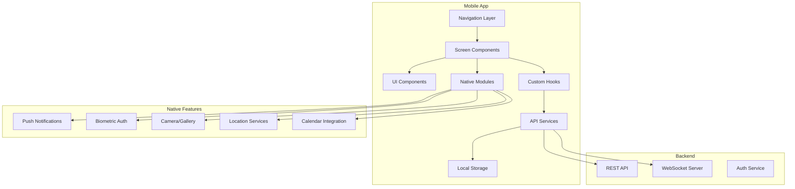

# Design Document: Mobile Feature Parity

## Overview

This design document outlines the architecture and implementation approach for bringing full feature parity to the HealthSync Android mobile application. The solution leverages React Native with a modular component architecture, shared API services, and native integrations for optimal mobile UX. The implementation will be phased, prioritizing core patient features first, then doctor/clinic features, and finally advanced features.

## Architecture



## Components and Interfaces

### Navigation Structure

```javascript
// mobile/src/navigation/AppNavigator.js
const Stack = createStackNavigator();
const Tab = createBottomTabNavigator();

// Main Navigation Structure
<Stack.Navigator>
  {/* Auth Flow */}
  <Stack.Screen name="Login" />
  <Stack.Screen name="Register" />
  <Stack.Screen name="ForgotPassword" />
  <Stack.Screen name="OTPVerification" />
  
  {/* Main App */}
  <Stack.Screen name="MainTabs" component={MainTabNavigator} />
  
  {/* Booking Flow */}
  <Stack.Screen name="DoctorProfile" />
  <Stack.Screen name="SlotSelection" />
  <Stack.Screen name="BookingConfirmation" />
  <Stack.Screen name="Payment" />
  
  {/* Appointment Flow */}
  <Stack.Screen name="AppointmentDetails" />
  <Stack.Screen name="VideoConsultation" />
  <Stack.Screen name="VirtualWaitingRoom" />
  <Stack.Screen name="Reschedule" />
  
  {/* Health Records */}
  <Stack.Screen name="MedicalTimeline" />
  <Stack.Screen name="UploadReport" />
  <Stack.Screen name="ViewPrescription" />
  <Stack.Screen name="AIReportAnalysis" />
  
  {/* Systematic History */}
  <Stack.Screen name="SystematicHistoryForm" />
  <Stack.Screen name="HistorySummary" />
  
  {/* Family */}
  <Stack.Screen name="FamilyMembers" />
  <Stack.Screen name="AddFamilyMember" />
  
  {/* Wallet */}
  <Stack.Screen name="HealthWallet" />
  <Stack.Screen name="AddMoney" />
  <Stack.Screen name="TransactionHistory" />
  
  {/* Services */}
  <Stack.Screen name="MedicineOrder" />
  <Stack.Screen name="LabTestBooking" />
  <Stack.Screen name="EmergencySOS" />
  <Stack.Screen name="AmbulanceBooking" />
  
  {/* Doctor Screens */}
  <Stack.Screen name="DoctorDashboard" />
  <Stack.Screen name="PatientQueue" />
  <Stack.Screen name="CreatePrescription" />
  <Stack.Screen name="DoctorEarnings" />
  
  {/* Clinic Screens */}
  <Stack.Screen name="ClinicDashboard" />
  <Stack.Screen name="WalkInRegistration" />
  <Stack.Screen name="StaffManagement" />
  
  {/* Settings */}
  <Stack.Screen name="Settings" />
  <Stack.Screen name="NotificationSettings" />
  <Stack.Screen name="LanguageSettings" />
</Stack.Navigator>
```

### API Service Layer

```javascript
// mobile/src/services/api/index.js
import axios from 'axios';
import AsyncStorage from '@react-native-async-storage/async-storage';

const API_BASE_URL = 'https://api.healthsync.com';

const apiClient = axios.create({
  baseURL: API_BASE_URL,
  timeout: 30000,
});

// Request interceptor for auth token
apiClient.interceptors.request.use(async (config) => {
  const token = await AsyncStorage.getItem('authToken');
  if (token) {
    config.headers.Authorization = `Bearer ${token}`;
  }
  return config;
});

// Response interceptor for token refresh
apiClient.interceptors.response.use(
  (response) => response,
  async (error) => {
    if (error.response?.status === 401) {
      // Handle token refresh
      await refreshToken();
      return apiClient.request(error.config);
    }
    return Promise.reject(error);
  }
);

export const authService = {
  login: (credentials) => apiClient.post('/auth/login', credentials),
  register: (data) => apiClient.post('/auth/register', data),
  verifyOTP: (data) => apiClient.post('/auth/verify-otp', data),
  refreshToken: () => apiClient.post('/auth/refresh'),
  logout: () => apiClient.post('/auth/logout'),
};

export const appointmentService = {
  getAppointments: (params) => apiClient.get('/appointments', { params }),
  bookAppointment: (data) => apiClient.post('/appointments', data),
  cancelAppointment: (id, reason) => apiClient.put(`/appointments/${id}/cancel`, { reason }),
  rescheduleAppointment: (id, data) => apiClient.put(`/appointments/${id}/reschedule`, data),
  getQueuePosition: (id) => apiClient.get(`/appointments/${id}/queue`),
};

export const doctorService = {
  searchDoctors: (params) => apiClient.get('/doctors/search', { params }),
  getDoctorProfile: (id) => apiClient.get(`/doctors/${id}`),
  getDoctorSlots: (id, date) => apiClient.get(`/doctors/${id}/slots`, { params: { date } }),
  getDoctorReviews: (id) => apiClient.get(`/doctors/${id}/reviews`),
  addToFavorites: (id) => apiClient.post(`/doctors/${id}/favorite`),
};

export const healthRecordService = {
  getTimeline: (patientId) => apiClient.get(`/patients/${patientId}/timeline`),
  uploadReport: (data) => apiClient.post('/reports/upload', data),
  getPrescriptions: (patientId) => apiClient.get(`/patients/${patientId}/prescriptions`),
  getVitalsHistory: (patientId) => apiClient.get(`/patients/${patientId}/vitals`),
};

export const walletService = {
  getBalance: () => apiClient.get('/wallet/balance'),
  getTransactions: () => apiClient.get('/wallet/transactions'),
  addMoney: (data) => apiClient.post('/wallet/add', data),
  initiatePayment: (data) => apiClient.post('/payments/initiate', data),
};

export const familyService = {
  getFamilyMembers: () => apiClient.get('/family'),
  addFamilyMember: (data) => apiClient.post('/family', data),
  updateFamilyMember: (id, data) => apiClient.put(`/family/${id}`, data),
  deleteFamilyMember: (id) => apiClient.delete(`/family/${id}`),
};
```

### Core UI Components

```javascript
// mobile/src/components/common/index.js

// Button with loading state and variants
export { default as Button } from './Button';

// Card with shadow and press feedback
export { default as Card } from './Card';

// Input with validation and icons
export { default as Input } from './Input';

// Avatar with fallback and status indicator
export { default as Avatar } from './Avatar';

// Badge for status and counts
export { default as Badge } from './Badge';

// Modal with animations
export { default as Modal } from './Modal';

// Bottom Sheet for actions
export { default as BottomSheet } from './BottomSheet';

// Loading indicators
export { default as Spinner } from './Spinner';
export { default as SkeletonLoader } from './SkeletonLoader';

// Empty states
export { default as EmptyState } from './EmptyState';

// Error boundary
export { default as ErrorBoundary } from './ErrorBoundary';

// Pull to refresh wrapper
export { default as RefreshableScrollView } from './RefreshableScrollView';

// Search bar with debounce
export { default as SearchBar } from './SearchBar';

// Date/Time pickers
export { default as DatePicker } from './DatePicker';
export { default as TimePicker } from './TimePicker';

// Rating display and input
export { default as Rating } from './Rating';

// Chip/Tag component
export { default as Chip } from './Chip';

// Progress indicators
export { default as ProgressBar } from './ProgressBar';
export { default as StepIndicator } from './StepIndicator';
```

### Screen Components Structure

```javascript
// Patient Screens
mobile/src/screens/
├── auth/
│   ├── LoginScreen.js
│   ├── RegisterScreen.js
│   ├── ForgotPasswordScreen.js
│   └── OTPVerificationScreen.js
├── home/
│   ├── HomeScreen.js
│   └── components/
│       ├── QuickActions.js
│       ├── UpcomingAppointments.js
│       ├── HealthTips.js
│       └── WalletSummary.js
├── doctors/
│   ├── DoctorsScreen.js
│   ├── DoctorProfileScreen.js
│   ├── DoctorSearchScreen.js
│   └── components/
│       ├── DoctorCard.js
│       ├── FilterPanel.js
│       └── SlotPicker.js
├── appointments/
│   ├── AppointmentsScreen.js
│   ├── AppointmentDetailsScreen.js
│   ├── RescheduleScreen.js
│   └── components/
│       ├── AppointmentCard.js
│       ├── QueueTracker.js
│       └── CancelModal.js
├── booking/
│   ├── BookingScreen.js
│   ├── SlotSelectionScreen.js
│   ├── PaymentScreen.js
│   └── ConfirmationScreen.js
├── records/
│   ├── RecordsScreen.js
│   ├── MedicalTimelineScreen.js
│   ├── UploadReportScreen.js
│   ├── PrescriptionViewScreen.js
│   └── AIAnalysisScreen.js
├── systematic-history/
│   ├── SystematicHistoryScreen.js
│   └── components/
│       ├── BodySystemSection.js
│       ├── SymptomChip.js
│       ├── PastHistorySection.js
│       └── AIRecommendations.js
├── family/
│   ├── FamilyMembersScreen.js
│   ├── AddFamilyMemberScreen.js
│   └── FamilyMemberProfileScreen.js
├── wallet/
│   ├── WalletScreen.js
│   ├── AddMoneyScreen.js
│   ├── TransactionHistoryScreen.js
│   └── components/
│       ├── BalanceCard.js
│       └── TransactionItem.js
├── services/
│   ├── VideoConsultScreen.js
│   ├── LabTestsScreen.js
│   ├── MedicineScreen.js
│   ├── EmergencyScreen.js
│   └── MedicalImagingScreen.js
├── profile/
│   ├── ProfileScreen.js
│   ├── EditProfileScreen.js
│   ├── SettingsScreen.js
│   └── NotificationSettingsScreen.js

// Doctor Screens
├── doctor/
│   ├── DoctorDashboardScreen.js
│   ├── PatientQueueScreen.js
│   ├── PatientDetailsScreen.js
│   ├── CreatePrescriptionScreen.js
│   ├── EarningsScreen.js
│   ├── ScheduleScreen.js
│   └── components/
│       ├── QueueItem.js
│       ├── PatientSummary.js
│       ├── DrugInteractionAlert.js
│       └── EarningsChart.js

// Clinic Screens
├── clinic/
│   ├── ClinicDashboardScreen.js
│   ├── WalkInRegistrationScreen.js
│   ├── StaffManagementScreen.js
│   ├── ClinicQueueScreen.js
│   └── components/
│       ├── QueueDisplay.js
│       ├── StaffCard.js
│       └── AnalyticsSummary.js
```

### Native Module Integrations

```javascript
// mobile/src/native/index.js

// Push Notifications
import messaging from '@react-native-firebase/messaging';
import PushNotification from 'react-native-push-notification';

export const pushNotificationService = {
  requestPermission: async () => {
    const authStatus = await messaging().requestPermission();
    return authStatus === messaging.AuthorizationStatus.AUTHORIZED;
  },
  
  getToken: async () => {
    return await messaging().getToken();
  },
  
  onMessage: (callback) => {
    return messaging().onMessage(callback);
  },
  
  scheduleLocalNotification: (notification) => {
    PushNotification.localNotificationSchedule(notification);
  },
};

// Biometric Authentication
import ReactNativeBiometrics from 'react-native-biometrics';

export const biometricService = {
  isAvailable: async () => {
    const { available, biometryType } = await ReactNativeBiometrics.isSensorAvailable();
    return { available, type: biometryType };
  },
  
  authenticate: async (promptMessage) => {
    const { success } = await ReactNativeBiometrics.simplePrompt({ promptMessage });
    return success;
  },
};

// Camera & Image Picker
import { launchCamera, launchImageLibrary } from 'react-native-image-picker';

export const imageService = {
  takePhoto: (options) => launchCamera(options),
  pickFromGallery: (options) => launchImageLibrary(options),
};

// Location Services
import Geolocation from '@react-native-community/geolocation';

export const locationService = {
  getCurrentPosition: () => {
    return new Promise((resolve, reject) => {
      Geolocation.getCurrentPosition(resolve, reject, {
        enableHighAccuracy: true,
        timeout: 15000,
      });
    });
  },
};

// Calendar Integration
import * as AddCalendarEvent from 'react-native-add-calendar-event';

export const calendarService = {
  addEvent: (eventConfig) => AddCalendarEvent.presentEventCreatingDialog(eventConfig),
};
```

### Offline Storage & Sync

```javascript
// mobile/src/services/offline/index.js
import AsyncStorage from '@react-native-async-storage/async-storage';
import NetInfo from '@react-native-community/netinfo';

class OfflineManager {
  constructor() {
    this.isOnline = true;
    this.pendingActions = [];
    
    NetInfo.addEventListener(state => {
      const wasOffline = !this.isOnline;
      this.isOnline = state.isConnected;
      
      if (wasOffline && this.isOnline) {
        this.syncPendingActions();
      }
    });
  }
  
  async cacheData(key, data) {
    await AsyncStorage.setItem(key, JSON.stringify({
      data,
      timestamp: Date.now(),
    }));
  }
  
  async getCachedData(key, maxAge = 3600000) {
    const cached = await AsyncStorage.getItem(key);
    if (!cached) return null;
    
    const { data, timestamp } = JSON.parse(cached);
    if (Date.now() - timestamp > maxAge) return null;
    
    return data;
  }
  
  async queueAction(action) {
    this.pendingActions.push(action);
    await AsyncStorage.setItem('pendingActions', JSON.stringify(this.pendingActions));
  }
  
  async syncPendingActions() {
    for (const action of this.pendingActions) {
      try {
        await action.execute();
        this.pendingActions = this.pendingActions.filter(a => a.id !== action.id);
      } catch (error) {
        console.error('Failed to sync action:', action.id);
      }
    }
    await AsyncStorage.setItem('pendingActions', JSON.stringify(this.pendingActions));
  }
}

export const offlineManager = new OfflineManager();
```

## Data Models

### User Session (AsyncStorage)

```typescript
interface UserSession {
  userId: string;
  email: string;
  phone: string;
  name: string;
  role: 'patient' | 'doctor' | 'clinic' | 'admin';
  authToken: string;
  refreshToken: string;
  profilePhoto: string;
  preferences: {
    language: string;
    darkMode: boolean;
    notifications: NotificationPreferences;
  };
}
```

### Cached Appointments

```typescript
interface CachedAppointment {
  _id: string;
  doctorId: string;
  doctorName: string;
  doctorPhoto: string;
  specialization: string;
  date: string;
  time: string;
  status: 'upcoming' | 'completed' | 'cancelled';
  type: 'in-person' | 'video';
  queuePosition?: number;
  clinicName: string;
  clinicAddress: string;
}
```

### Offline Action Queue

```typescript
interface QueuedAction {
  id: string;
  type: 'booking' | 'cancellation' | 'upload' | 'update';
  payload: any;
  timestamp: number;
  retryCount: number;
}
```

## Correctness Properties

*A property is a characteristic or behavior that should hold true across all valid executions of a system-essentially, a formal statement about what the system should do. Properties serve as the bridge between human-readable specifications and machine-verifiable correctness guarantees.*


### Property 1: Authentication Token Persistence Round-Trip

*For any* valid user credentials, after successful login the auth token stored in secure storage SHALL be retrievable and valid for API authentication.

**Validates: Requirements 1.1, 1.6**

### Property 2: Logout Clears All User Data

*For any* logged-in user session, after logout ALL user-related data (tokens, cached appointments, profile data) SHALL be removed from local storage.

**Validates: Requirements 1.8**

### Property 3: Doctor Search Filter Correctness

*For any* search query with filters (specialization, location, gender, experience, fees), all returned doctors SHALL match ALL applied filter criteria.

**Validates: Requirements 3.1, 3.3**

### Property 4: Family Member Booking Association

*For any* appointment booked for a family member, the booking record SHALL correctly associate with the selected family member's ID and display their name.

**Validates: Requirements 3.6**

### Property 5: QR Code Booking Round-Trip

*For any* confirmed booking, the generated QR code SHALL decode to the correct booking ID, and scanning that QR SHALL retrieve the correct booking details.

**Validates: Requirements 3.8, 4.5**

### Property 6: Favorites List Round-Trip

*For any* doctor added to favorites, the favorites list SHALL contain that doctor, and removing them SHALL result in their absence from the list.

**Validates: Requirements 3.9**

### Property 7: Appointment Reschedule Persistence

*For any* rescheduled appointment, the new date/time SHALL be persisted and the appointment status SHALL remain 'upcoming'.

**Validates: Requirements 4.2**

### Property 8: Appointment Cancellation State

*For any* cancelled appointment, the status SHALL change to 'cancelled' and the appointment SHALL no longer appear in upcoming appointments list.

**Validates: Requirements 4.3**

### Property 9: Queue Position Accuracy

*For any* appointment in queue, the queue position SHALL equal the count of appointments ahead of it with earlier check-in times.

**Validates: Requirements 4.4**

### Property 10: Report Upload Round-Trip

*For any* uploaded lab report, the report SHALL be retrievable from the server with the same file content and metadata.

**Validates: Requirements 6.2**

### Property 11: Vitals History Aggregation

*For any* patient's vitals history query, the returned data SHALL include all recorded vitals within the specified date range, sorted by timestamp.

**Validates: Requirements 6.5**

### Property 12: Systematic History Persistence Round-Trip

*For any* completed systematic history form, saving and then loading SHALL return the exact same symptom selections, durations, severities, and past history data.

**Validates: Requirements 7.1, 7.2, 7.3, 7.4, 7.5, 7.6**

### Property 13: Family Member CRUD Consistency

*For any* family member, after add operation they SHALL appear in the list, after update their data SHALL reflect changes, and after delete they SHALL not appear in the list.

**Validates: Requirements 8.1, 8.2**

### Property 14: Wallet Balance Calculation

*For any* wallet with transactions, the balance SHALL equal the sum of all credit transactions minus the sum of all debit transactions.

**Validates: Requirements 9.1, 9.2, 9.3**

### Property 15: Offline Cache Round-Trip

*For any* data cached while offline, when connection restores the cached data SHALL be available and queued actions SHALL be synced to the server.

**Validates: Requirements 14.1, 14.2, 14.3, 14.4**

### Property 16: Notification Scheduling Accuracy

*For any* scheduled notification (appointment reminder, medicine reminder), the notification SHALL fire within 1 minute of the scheduled time.

**Validates: Requirements 13.1, 13.2, 13.3**

### Property 17: Referral Code Uniqueness

*For any* generated referral code, it SHALL be unique across all users and SHALL correctly track referral source when used.

**Validates: Requirements 18.1, 18.3**

## Error Handling

| Error Scenario | Handling Strategy |
|----------------|-------------------|
| Network timeout | Show retry button, use cached data if available |
| Authentication failure | Redirect to login, clear invalid tokens |
| Payment failure | Show error message, allow retry, preserve booking state |
| Upload failure | Queue for retry, show progress indicator |
| Location permission denied | Show manual location entry option |
| Camera permission denied | Show gallery picker as alternative |
| Biometric unavailable | Fall back to PIN/password |
| Offline mode | Show offline indicator, queue actions for sync |
| API rate limit | Implement exponential backoff |
| Invalid QR code | Show error with manual entry option |

## Testing Strategy

### Unit Tests

Unit tests will verify specific examples and edge cases:

- Authentication flow edge cases (invalid credentials, expired tokens)
- Form validation (email format, phone format, required fields)
- Date/time formatting and timezone handling
- Currency formatting and calculations
- Search query parsing and filter application
- QR code generation and parsing
- Offline queue management

### Property-Based Tests

Property-based tests will use `fast-check` to verify universal properties:

- **Authentication round-trip**: Token storage and retrieval
- **Data persistence**: Cache and sync operations
- **Filter correctness**: Search results match criteria
- **Calculation accuracy**: Wallet balance, queue position
- **State transitions**: Appointment status changes

Each property test will run minimum 100 iterations with randomized inputs.

### Integration Tests

- End-to-end booking flow
- Video consultation connection
- Payment gateway integration
- Push notification delivery
- Offline sync scenarios

### Test Configuration

```javascript
// Example property test structure for React Native
import fc from 'fast-check';

describe('Mobile Feature Parity Properties', () => {
  // Feature: mobile-feature-parity, Property 3: Doctor Search Filter Correctness
  it('should filter doctors correctly by all criteria', () => {
    fc.assert(
      fc.property(
        fc.array(doctorArbitrary),
        fc.record({
          specialization: fc.constantFrom('Cardiologist', 'Dermatologist', 'General'),
          gender: fc.constantFrom('male', 'female'),
          minExperience: fc.integer({ min: 0, max: 30 }),
        }),
        (doctors, filters) => {
          const filtered = filterDoctors(doctors, filters);
          return filtered.every(d => 
            d.specialization === filters.specialization &&
            d.gender === filters.gender &&
            d.experience >= filters.minExperience
          );
        }
      ),
      { numRuns: 100 }
    );
  });
});
```

## Implementation Phases

### Phase 1: Core Patient Features (Weeks 1-4)
- Authentication (login, register, OTP, biometric)
- Home screen with dashboard
- Doctor search and booking
- Appointment management
- Basic profile

### Phase 2: Health Records & Services (Weeks 5-8)
- Medical timeline and records
- Report upload and viewing
- Systematic history form
- Family members management
- Health wallet

### Phase 3: Advanced Features (Weeks 9-12)
- Video consultation
- Medicine ordering
- Lab test booking
- Push notifications
- Offline support

### Phase 4: Doctor & Clinic Features (Weeks 13-16)
- Doctor dashboard
- Prescription creation
- Clinic queue management
- Staff management
- Analytics

### Phase 5: Polish & Optimization (Weeks 17-18)
- Performance optimization
- Accessibility improvements
- Dark mode
- Multi-language support
- Final testing
