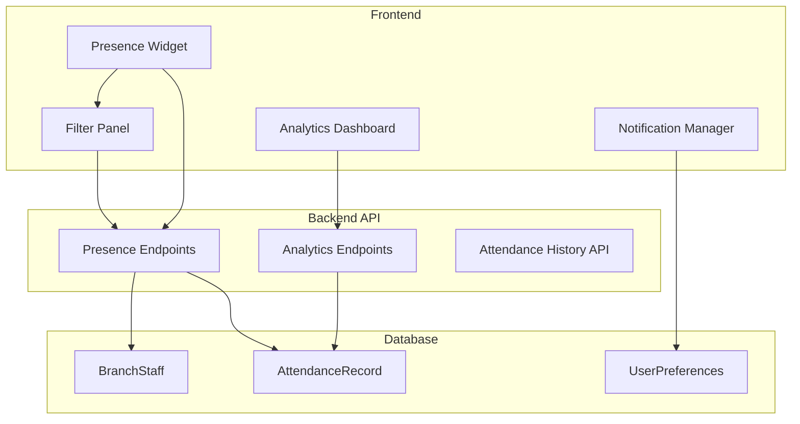

# Design Document: Staff Presence Analytics

## Overview

This design extends the existing staff presence tracking system with customization capabilities and a comprehensive analytics dashboard. The solution builds on the current `BranchStaff` model and presence endpoints, adding new data models for attendance history, filter presets, and notification preferences. The frontend will include an enhanced presence widget with filtering UI and a new analytics section with interactive charts.

## Architecture



## Components and Interfaces

### Backend Components

#### 1. AttendanceRecord Model

New MongoDB model to store historical check-in/out events.

```javascript
// backend/models/AttendanceRecord.js
const attendanceRecordSchema = new mongoose.Schema({
  staffId: { type: ObjectId, ref: 'BranchStaff', required: true },
  userId: { type: ObjectId, ref: 'User', required: true },
  organizationId: { type: ObjectId, ref: 'Clinic', required: true },
  branchId: { type: ObjectId, ref: 'HospitalBranch' },
  
  eventType: { type: String, enum: ['check_in', 'check_out'], required: true },
  timestamp: { type: Date, required: true, default: Date.now },
  
  // For check-out events
  shiftDuration: { type: Number }, // minutes
  checkInTime: { type: Date }, // reference to paired check-in
  
  // Status at time of event
  customStatus: { type: String },
  
  // Metadata
  source: { type: String, enum: ['manual', 'auto', 'system'], default: 'manual' },
  ipAddress: { type: String },
  
}, { timestamps: true });

// Indexes for efficient querying
attendanceRecordSchema.index({ staffId: 1, timestamp: -1 });
attendanceRecordSchema.index({ organizationId: 1, timestamp: -1 });
attendanceRecordSchema.index({ branchId: 1, timestamp: -1 });
```

#### 2. Enhanced BranchStaff Model

Add custom status field to existing model.

```javascript
// Add to existing BranchStaff schema
customStatus: { 
  type: String, 
  enum: ['available', 'with_patient', 'in_surgery', 'on_break', 'in_meeting', 'unavailable', null],
  default: null 
},
customStatusText: { type: String, maxLength: 50 },
scheduledStartTime: { type: String }, // "09:00"
scheduledEndTime: { type: String },   // "17:00"
```

#### 3. Presence API Extensions

```javascript
// GET /api/branch-staff/presence/:orgId
// Enhanced with filter query params
// Query params: role, branchId, department, status

// POST /api/branch-staff/status
// Set custom status
// Body: { status: 'in_surgery', statusText: 'Emergency surgery Room 3' }

// GET /api/branch-staff/attendance/:orgId
// Get attendance history
// Query params: startDate, endDate, staffId, branchId

// GET /api/branch-staff/analytics/:orgId
// Get computed analytics
// Query params: startDate, endDate, groupBy (day|week|month)
```

#### 4. Analytics Service

```javascript
// backend/services/attendanceAnalytics.js
class AttendanceAnalyticsService {
  // Calculate average check-in/out times
  async getAverageTimings(orgId, dateRange, filters) {}
  
  // Calculate hours worked per staff
  async getHoursWorked(orgId, dateRange, groupBy) {}
  
  // Detect late arrivals based on scheduled times
  async getLateArrivals(orgId, dateRange, threshold) {}
  
  // Detect early departures
  async getEarlyDepartures(orgId, dateRange, threshold) {}
  
  // Calculate overtime
  async getOvertimeReport(orgId, dateRange, standardHours) {}
  
  // Branch comparison metrics
  async getBranchComparison(orgId, dateRange) {}
  
  // Export to CSV
  async exportToCSV(orgId, dateRange, reportType) {}
}
```

### Frontend Components

#### 1. Enhanced Presence Widget

```jsx
// Components structure
<PresenceWidget>
  <PresenceHeader>
    <FilterButton onClick={toggleFilters} />
    <StatusCounts checkedIn={n} checkedOut={m} />
  </PresenceHeader>
  
  <FilterPanel visible={showFilters}>
    <RoleFilter options={roles} selected={roleFilter} />
    <BranchFilter options={branches} selected={branchFilter} />
    <DepartmentFilter options={departments} selected={deptFilter} />
    <PresetSelector presets={savedPresets} />
    <SavePresetButton />
  </FilterPanel>
  
  <StaffList>
    {filteredStaff.map(staff => (
      <StaffCard 
        staff={staff}
        onWatch={toggleWatch}
        isWatched={watchedIds.includes(staff._id)}
      />
    ))}
  </StaffList>
  
  <PresenceFooter>
    <RefreshButton />
    <AnalyticsLink />
  </PresenceFooter>
</PresenceWidget>
```

#### 2. Analytics Dashboard Component

```jsx
// frontend/src/components/emr/StaffAnalyticsSection.js
<StaffAnalyticsSection>
  <AnalyticsHeader>
    <DateRangePicker value={dateRange} onChange={setDateRange} />
    <BranchSelector value={selectedBranch} />
    <ExportButton onClick={exportCSV} />
  </AnalyticsHeader>
  
  <MetricCards>
    <MetricCard title="Avg Check-in" value={avgCheckIn} />
    <MetricCard title="Avg Check-out" value={avgCheckOut} />
    <MetricCard title="Total Hours" value={totalHours} />
    <MetricCard title="Overtime Hours" value={overtimeHours} />
  </MetricCards>
  
  <ChartsGrid>
    <AttendanceTrendChart data={trendData} />
    <HoursWorkedChart data={hoursData} />
    <BranchComparisonChart data={branchData} />
    <LateArrivalsChart data={lateData} />
  </ChartsGrid>
  
  <StaffTable>
    <columns: name, avgCheckIn, avgCheckOut, hoursWorked, lateCount, overtimeHours />
    <sortable, filterable />
  </StaffTable>
  
  <AlertsPanel>
    {patterns.map(pattern => <PatternAlert pattern={pattern} />)}
  </AlertsPanel>
</StaffAnalyticsSection>
```

#### 3. Notification Manager

```javascript
// frontend/src/hooks/usePresenceNotifications.js
function usePresenceNotifications(staffPresence, watchedIds) {
  const prevPresence = useRef(staffPresence);
  
  useEffect(() => {
    // Compare current vs previous presence
    // Detect check-in/out changes for watched staff
    // Trigger toast notifications
  }, [staffPresence, watchedIds]);
}
```

## Data Models

### AttendanceRecord

| Field | Type | Description |
|-------|------|-------------|
| staffId | ObjectId | Reference to BranchStaff |
| userId | ObjectId | Reference to User |
| organizationId | ObjectId | Reference to Clinic |
| branchId | ObjectId | Reference to HospitalBranch |
| eventType | String | 'check_in' or 'check_out' |
| timestamp | Date | When the event occurred |
| shiftDuration | Number | Minutes (for check-out only) |
| checkInTime | Date | Paired check-in time (for check-out) |
| customStatus | String | Status at time of event |

### FilterPreset (localStorage)

```typescript
interface FilterPreset {
  id: string;
  name: string;
  filters: {
    roles: string[];
    branches: string[];
    departments: string[];
    statuses: string[];
  };
  createdAt: string;
}
```

### NotificationPreferences (localStorage)

```typescript
interface NotificationPreferences {
  watchedStaffIds: string[];
  notifyOnCheckIn: boolean;
  notifyOnCheckOut: boolean;
  soundEnabled: boolean;
}
```

## Correctness Properties

*A property is a characteristic or behavior that should hold true across all valid executions of a system-essentially, a formal statement about what the system should do. Properties serve as the bridge between human-readable specifications and machine-verifiable correctness guarantees.*


### Property 1: Filter by Attribute Correctness

*For any* staff list and any single filter (role, branch, or department), applying that filter SHALL return only staff members whose corresponding attribute matches the filter value, and the result set SHALL be a subset of the original list.

**Validates: Requirements 1.2, 1.3, 1.4**

### Property 2: Combined Filter AND Logic

*For any* staff list and any combination of filters (role, branch, department), the filtered result SHALL contain only staff members that satisfy ALL applied filter criteria simultaneously.

**Validates: Requirements 1.5**

### Property 3: Filter Clear Round-Trip

*For any* staff list, applying any combination of filters and then clearing all filters SHALL return the original complete staff list.

**Validates: Requirements 1.6**

### Property 4: Checkout Clears Custom Status

*For any* staff member with a custom status set, when they check out, their custom status SHALL be set to null/cleared.

**Validates: Requirements 2.4**

### Property 5: Preset Save-Load Round-Trip

*For any* valid filter combination saved as a preset, loading that preset SHALL restore the exact same filter values that were saved.

**Validates: Requirements 3.2**

### Property 6: Attendance Record Completeness

*For any* check-in or check-out event, the created attendance record SHALL contain: staffId, userId, organizationId, eventType, timestamp, and (if set) customStatus. For check-out events, it SHALL also contain shiftDuration and checkInTime.

**Validates: Requirements 5.1, 5.2, 5.5**

### Property 7: Shift Duration Calculation

*For any* check-out event with a paired check-in, the shiftDuration SHALL equal the difference between check-out timestamp and check-in timestamp in minutes.

**Validates: Requirements 5.2**

### Property 8: Date Range Query Filtering

*For any* attendance history query with a date range, all returned records SHALL have timestamps within the specified start and end dates (inclusive).

**Validates: Requirements 5.4**

### Property 9: Average Time Calculation

*For any* set of attendance records for a staff member, the calculated average check-in time SHALL equal the arithmetic mean of all check-in timestamps' time-of-day values, and similarly for check-out times.

**Validates: Requirements 6.1, 6.2**

### Property 10: Total Hours Aggregation

*For any* staff member over a time period, the total hours worked SHALL equal the sum of all shiftDuration values for their check-out records in that period.

**Validates: Requirements 6.3**

### Property 11: Schedule Deviation Detection

*For any* check-in event where the timestamp is after the staff member's scheduledStartTime, the system SHALL flag it as a late arrival. *For any* check-out event where the timestamp is before the staff member's scheduledEndTime, the system SHALL flag it as an early departure.

**Validates: Requirements 6.5, 6.6**

### Property 12: Branch Aggregation Correctness

*For any* branch, the staff count SHALL equal the number of active staff assigned to that branch, the average hours SHALL equal the mean of all staff hours in that branch, and the peak hour SHALL be the hour with the maximum concurrent checked-in staff.

**Validates: Requirements 7.1, 7.2, 7.3**

### Property 13: Branch Normalization

*For any* branch comparison metric, the normalized value SHALL equal the raw value divided by the branch's total staff count, ensuring fair comparison regardless of branch size.

**Validates: Requirements 7.4**

### Property 14: Overtime Calculation

*For any* staff member with a defined standard shift length, overtime hours SHALL equal max(0, actual hours worked - standard hours). Total overtime SHALL be the sum of daily overtime values.

**Validates: Requirements 8.1, 8.2**

### Property 15: Overtime Threshold Highlighting

*For any* staff member whose total overtime exceeds the configured threshold, they SHALL be included in the "excessive overtime" highlighted list.

**Validates: Requirements 8.3**

### Property 16: Pattern Detection for Late Arrivals

*For any* staff member with N or more consecutive late arrivals (where N is the configured threshold), the system SHALL detect and flag a "consistent late arrival" pattern.

**Validates: Requirements 8.4**

### Property 17: CSV Export Completeness

*For any* exported CSV report, it SHALL contain all attendance records matching the query criteria, with columns for: staffName, date, checkInTime, checkOutTime, shiftDuration, customStatus, and any detected flags (late/early/overtime).

**Validates: Requirements 8.6**

## Error Handling

| Error Scenario | Handling Strategy |
|----------------|-------------------|
| Invalid date range (end before start) | Return empty results with warning message |
| Missing staff schedule times | Skip late/early detection for that staff |
| Orphaned check-out (no paired check-in) | Record check-out, set shiftDuration to null |
| Deleted branch in preset | Remove invalid branch from filter, apply remaining |
| API timeout on analytics query | Show cached data with stale indicator |
| localStorage quota exceeded | Warn user, offer to clear old presets |

## Testing Strategy

### Unit Tests

Unit tests will verify specific examples and edge cases:

- Filter panel toggle visibility
- Predefined status options exist
- Preset CRUD operations
- Watch/unwatch staff functionality
- CSV export format correctness
- Mobile breakpoint detection

### Property-Based Tests

Property-based tests will use a library like `fast-check` to verify universal properties:

- **Filter correctness**: Generate random staff lists and filter values, verify filtered results
- **Round-trip properties**: Save/load presets, apply/clear filters
- **Calculation accuracy**: Generate attendance records, verify computed metrics
- **Date range queries**: Generate random date ranges, verify all results fall within range
- **Overtime/late detection**: Generate schedules and attendance, verify correct flagging

Each property test will run minimum 100 iterations with randomized inputs.

### Test Configuration

```javascript
// Example property test structure
describe('Staff Presence Analytics Properties', () => {
  // Feature: staff-presence-analytics, Property 1: Filter by Attribute Correctness
  it('should filter staff by role correctly', () => {
    fc.assert(
      fc.property(
        fc.array(staffArbitrary),
        fc.constantFrom('doctor', 'nurse', 'receptionist'),
        (staffList, role) => {
          const filtered = filterByRole(staffList, role);
          return filtered.every(s => s.role === role) &&
                 filtered.length <= staffList.length;
        }
      ),
      { numRuns: 100 }
    );
  });
});
```
