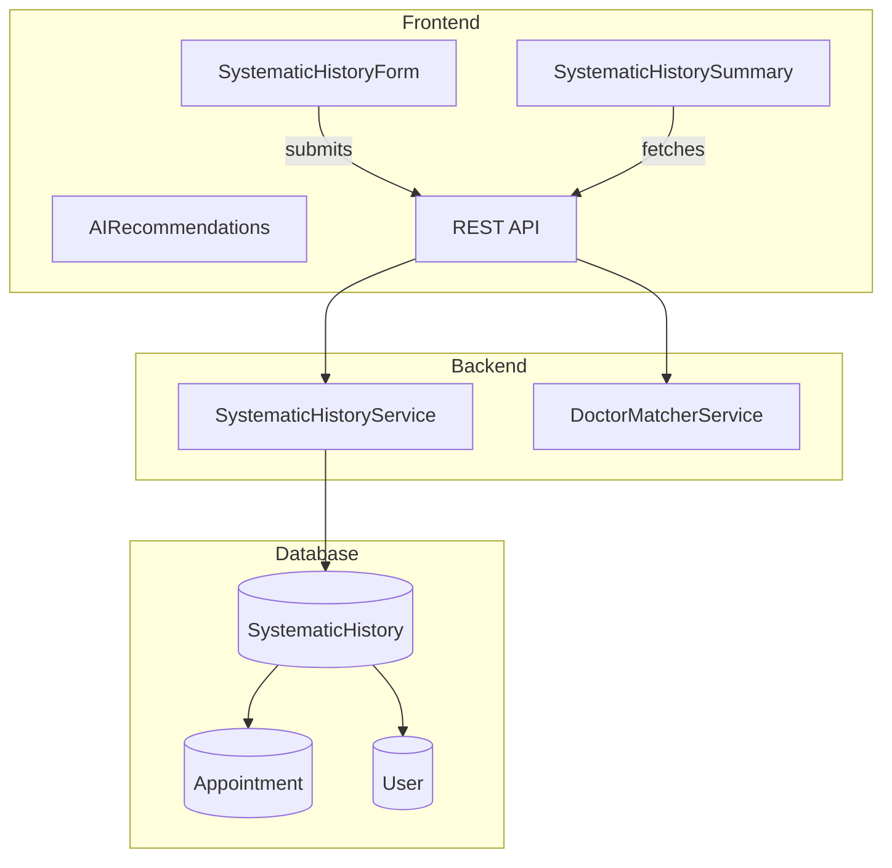

# Design Document: Systematic History

## Overview

Systematic History transforms HealthSync into a clinical-grade platform by implementing structured symptom collection across body systems. This feature enables patients to provide comprehensive health information through an intuitive step-by-step flow, gives doctors organized summaries for efficient consultations, and powers AI-based doctor recommendations.

The implementation follows a modular architecture with reusable components, a flexible data model, and integration points for the existing booking flow, doctor dashboard, and clinic management system.

## Architecture



### Data Flow

1. **Patient Flow**: Patient initiates booking → Systematic History Form → Submit → Store in DB → AI Recommendations → Doctor Selection → Complete Booking
2. **Doctor Flow**: View Appointment → Fetch Systematic History → Display Summary Card
3. **Clinic Flow**: Queue View → Fetch All Histories → Display Indicators → Expandable Details

## Components and Interfaces

### Frontend Components

#### 1. SystematicHistoryForm
Main multi-step form component for symptom collection.

```typescript
interface SystematicHistoryFormProps {
  appointmentId?: string;
  userId: string;
  onComplete: (history: SystematicHistoryData) => void;
  onSkip?: () => void;
  previousHistory?: SystematicHistoryData;
}

interface FormStep {
  id: string;
  title: string;
  system: BodySystem;
  symptoms: Symptom[];
  isComplete: boolean;
}
```

#### 2. SymptomChip
Toggleable symptom selection component.

```typescript
interface SymptomChipProps {
  symptom: Symptom;
  selected: boolean;
  onToggle: (symptomId: string) => void;
  onDetailsChange: (details: SymptomDetails) => void;
}

interface SymptomDetails {
  duration: 'days' | 'week' | 'weeks' | 'month';
  severity: 1 | 2 | 3 | 4 | 5;
}
```

#### 3. SystematicHistorySummary
Doctor-facing summary display component.

```typescript
interface SystematicHistorySummaryProps {
  history: SystematicHistoryData;
  compact?: boolean;
  expandable?: boolean;
  onPrint?: () => void;
}
```

#### 4. AIRecommendations
Specialist recommendation display.

```typescript
interface AIRecommendationsProps {
  symptoms: SymptomSelection[];
  onSelectSpecialization: (spec: string) => void;
}
```

### Backend Services

#### 1. SystematicHistoryService

```javascript
class SystematicHistoryService {
  // Create new systematic history
  async create(userId, appointmentId, historyData)
  
  // Get history by appointment
  async getByAppointment(appointmentId)
  
  // Get user's latest history
  async getLatestByUser(userId)
  
  // Get all versions for a user
  async getUserHistoryVersions(userId)
  
  // Update existing history (creates new version)
  async update(historyId, updates)
}
```

#### 2. DoctorMatcherService

```javascript
class DoctorMatcherService {
  // Analyze symptoms and return recommendations
  async getRecommendations(symptoms)
  
  // Get matching score for a doctor
  async getDoctorMatchScore(doctorId, symptoms)
  
  // Symptom-to-specialization mapping rules
  getSpecializationRules()
}
```

### API Endpoints

| Method | Endpoint | Description |
|--------|----------|-------------|
| POST | `/api/systematic-history` | Create new history |
| GET | `/api/systematic-history/appointment/:id` | Get by appointment |
| GET | `/api/systematic-history/user/:id/latest` | Get user's latest |
| GET | `/api/systematic-history/user/:id/versions` | Get all versions |
| PUT | `/api/systematic-history/:id` | Update history |
| POST | `/api/systematic-history/recommendations` | Get AI recommendations |

## Data Models

### SystematicHistory Schema

```javascript
const SystematicHistorySchema = new Schema({
  userId: { type: Schema.Types.ObjectId, ref: 'User', required: true },
  appointmentId: { type: Schema.Types.ObjectId, ref: 'Appointment' },
  version: { type: Number, default: 1 },
  
  // Body Systems
  general: {
    symptoms: [{
      name: String,
      present: Boolean,
      duration: { type: String, enum: ['days', 'week', 'weeks', 'month'] },
      severity: { type: Number, min: 1, max: 5 }
    }]
  },
  respiratory: { symptoms: [SymptomSchema] },
  cardiovascular: { symptoms: [SymptomSchema] },
  gastrointestinal: { symptoms: [SymptomSchema] },
  genitourinary: { symptoms: [SymptomSchema] },
  neurological: { symptoms: [SymptomSchema] },
  musculoskeletal: { symptoms: [SymptomSchema] },
  skin: { symptoms: [SymptomSchema] },
  endocrine: { symptoms: [SymptomSchema] },
  
  // Past History
  pastHistory: {
    conditions: [String],
    surgeries: [String],
    hospitalizations: [String]
  },
  
  // Medications
  currentMedications: [{
    name: String,
    dosage: String,
    frequency: String
  }],
  
  // Allergies
  allergies: {
    drugs: [String],
    food: [String],
    other: [String]
  },
  
  // Attachments
  attachments: [{
    type: String,
    url: String,
    name: String
  }],
  
  // AI Recommendations
  aiRecommendations: [{
    specialization: String,
    confidence: Number,
    reason: String
  }],
  
  // Metadata
  completedAt: Date,
  createdAt: { type: Date, default: Date.now },
  updatedAt: Date
});
```

### Symptom Configuration

```javascript
const BODY_SYSTEMS = {
  general: {
    name: 'General',
    icon: '🌡️',
    symptoms: ['Fever', 'Weight Loss', 'Fatigue', 'Weakness', 'Appetite Changes', 'Night Sweats']
  },
  respiratory: {
    name: 'Respiratory',
    icon: '🫁',
    symptoms: ['Cough', 'Breathlessness', 'Wheezing', 'Chest Tightness', 'Sputum', 'Snoring']
  },
  cardiovascular: {
    name: 'Cardiovascular',
    icon: '❤️',
    symptoms: ['Chest Pain', 'Palpitations', 'Leg Swelling', 'Dizziness', 'Fainting']
  },
  gastrointestinal: {
    name: 'Gastrointestinal',
    icon: '🫃',
    symptoms: ['Nausea', 'Vomiting', 'Abdominal Pain', 'Diarrhea', 'Constipation', 'Bloating', 'Heartburn']
  },
  genitourinary: {
    name: 'Genitourinary',
    icon: '🚿',
    symptoms: ['Painful Urination', 'Frequent Urination', 'Blood in Urine', 'Incontinence']
  },
  neurological: {
    name: 'Neurological',
    icon: '🧠',
    symptoms: ['Headache', 'Dizziness', 'Numbness', 'Tingling', 'Vision Changes', 'Memory Issues', 'Seizures']
  },
  musculoskeletal: {
    name: 'Musculoskeletal',
    icon: '🦴',
    symptoms: ['Joint Pain', 'Muscle Pain', 'Stiffness', 'Swelling', 'Limited Movement', 'Back Pain']
  },
  skin: {
    name: 'Skin',
    icon: '🖐️',
    symptoms: ['Rash', 'Itching', 'Dryness', 'Discoloration', 'Lumps', 'Hair Loss']
  },
  endocrine: {
    name: 'Endocrine',
    icon: '⚖️',
    symptoms: ['Excessive Thirst', 'Frequent Urination', 'Heat/Cold Intolerance', 'Tremors', 'Mood Changes']
  }
};
```

### AI Recommendation Rules

```javascript
const SPECIALIZATION_RULES = [
  {
    symptoms: ['Cough', 'Breathlessness', 'Wheezing', 'Chest Tightness'],
    systems: ['respiratory'],
    recommendations: ['Pulmonologist', 'General Physician'],
    confidence: 0.85
  },
  {
    symptoms: ['Chest Pain', 'Palpitations', 'Leg Swelling'],
    systems: ['cardiovascular'],
    recommendations: ['Cardiologist', 'General Physician'],
    confidence: 0.9
  },
  {
    symptoms: ['Joint Pain', 'Stiffness', 'Swelling'],
    systems: ['musculoskeletal'],
    recommendations: ['Orthopedic', 'Rheumatologist'],
    confidence: 0.85
  },
  {
    symptoms: ['Headache', 'Dizziness', 'Numbness', 'Vision Changes'],
    systems: ['neurological'],
    recommendations: ['Neurologist', 'General Physician'],
    confidence: 0.85
  },
  {
    symptoms: ['Abdominal Pain', 'Nausea', 'Vomiting', 'Diarrhea'],
    systems: ['gastrointestinal'],
    recommendations: ['Gastroenterologist', 'General Physician'],
    confidence: 0.8
  },
  {
    symptoms: ['Rash', 'Itching', 'Discoloration'],
    systems: ['skin'],
    recommendations: ['Dermatologist'],
    confidence: 0.9
  },
  {
    multiSystem: true,
    minSystems: 3,
    recommendations: ['General Physician', 'Internal Medicine'],
    confidence: 0.95
  }
];
```

## Correctness Properties

*A property is a characteristic or behavior that should hold true across all valid executions of a system-essentially, a formal statement about what the system should do. Properties serve as the bridge between human-readable specifications and machine-verifiable correctness guarantees.*

### Property 1: Step Progression Consistency
*For any* body system section that is marked complete, the next section in sequence should become active and accessible.
**Validates: Requirements 1.2**

### Property 2: Symptom Detail Requirement
*For any* symptom that is selected (toggled to Yes), the system should require and store both duration and severity values before allowing progression.
**Validates: Requirements 1.4**

### Property 3: Skip Section Handling
*For any* body system section that is skipped, the stored data should contain an empty symptoms array and the section should be marked as reviewed.
**Validates: Requirements 1.5**

### Property 4: History Pre-fill Consistency
*For any* user with existing systematic history, when starting a new form, the past history and medications fields should be pre-populated with values from the most recent submission.
**Validates: Requirements 3.4**

### Property 5: Summary Display Grouping
*For any* systematic history data, the doctor summary view should display symptoms grouped by their respective body system, with each system clearly labeled.
**Validates: Requirements 4.2**

### Property 6: Duration and Severity Display
*For any* symptom in the summary that has duration and severity values, both values should be visible in the display output.
**Validates: Requirements 4.3**

### Property 7: Empty System Indicator
*For any* body system with zero selected symptoms, the summary display should show a "No" or equivalent negative indicator for that system.
**Validates: Requirements 4.4**

### Property 8: Symptom-to-Specialist Mapping
*For any* set of symptoms matching a specialization rule pattern, the AI recommendations should include the corresponding specialist(s) with appropriate confidence scores.
**Validates: Requirements 5.2, 5.3, 5.4, 5.5**

### Property 9: Multi-System General Physician Rule
*For any* systematic history with symptoms present in 3 or more body systems, the AI recommendations should include "General Physician" as a primary recommendation.
**Validates: Requirements 5.6**

### Property 10: History Persistence Round-Trip
*For any* systematic history submission, storing and then retrieving by appointment ID should return an equivalent data structure with all symptoms, past history, and medications intact.
**Validates: Requirements 6.1, 6.5**

### Property 11: Version Preservation on Edit
*For any* edit operation on existing systematic history, the original version should remain unchanged and a new version with incremented version number should be created.
**Validates: Requirements 6.4**

### Property 12: Clinic Queue Completion Indicator
*For any* appointment in the clinic queue, the completion indicator should accurately reflect whether systematic history exists for that appointment.
**Validates: Requirements 7.3**

## Error Handling

| Error Scenario | Handling Strategy |
|----------------|-------------------|
| Network failure during submission | Auto-save to localStorage, queue for sync |
| Invalid symptom data | Validate on client, reject on server with specific error |
| Missing required fields | Highlight missing fields, prevent progression |
| Previous history fetch fails | Allow fresh start, show warning |
| AI recommendation service unavailable | Show generic recommendations, log error |
| File upload fails | Retry with exponential backoff, allow skip |

## Testing Strategy

### Unit Testing
- Test each body system symptom configuration
- Test symptom chip toggle behavior
- Test severity slider value mapping
- Test step progression logic
- Test AI recommendation rule matching

### Property-Based Testing
Using fast-check library for JavaScript:

- **Property 1-3**: Generate random step completion sequences, verify progression rules
- **Property 4**: Generate users with/without history, verify pre-fill behavior
- **Property 5-7**: Generate random systematic history data, verify summary display rules
- **Property 8-9**: Generate random symptom combinations, verify specialist recommendations
- **Property 10**: Generate random history data, verify storage round-trip
- **Property 11**: Generate edit operations, verify version preservation
- **Property 12**: Generate queue with mixed completion states, verify indicators

### Integration Testing
- Full form submission flow
- Doctor dashboard history display
- Clinic queue integration
- AI recommendation integration with booking flow

### Mobile Testing
- Touch target sizes (48px minimum)
- Horizontal scroll behavior
- Haptic feedback triggers
- Offline mode and sync
- Auto-save functionality
