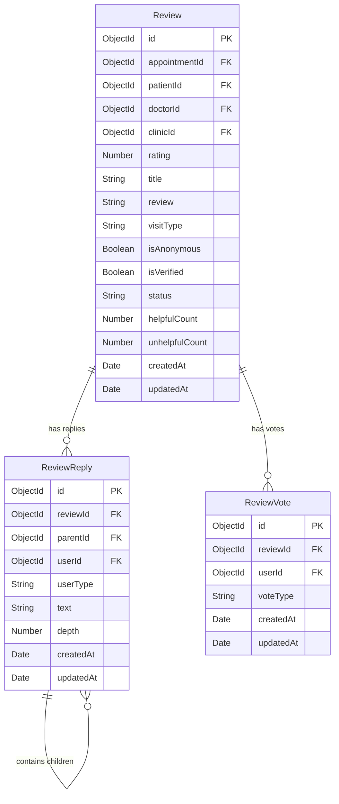

# Doctor Review Community System - Architecture

This document describes the architectural specifications for the production-grade Doctor Review Community System. The design merges the trust and verify mechanisms of clinical reviews (Practo, Mayo Clinic) with discussion capabilities (Reddit).

---

## 1. Database Model Design

### A. Review Schema (`Review.js`)
* Maps one-to-one with an `Appointment` to verify the patient actually had a consultation.
* Employs compound indexes to query by doctor, rating filter, and type of visit without collection scans.

### B. Review Reply Schema (`ReviewReply.js`)
* Stores a recursive tree relation where `parentId` references another `ReviewReply` (or `null` for top-level reply).
* Depth validation is enforced up to level 3:
  1. Top-Level Reply (Depth 1)
  2. Reply to Reply (Depth 2)
  3. Reply to Reply to Reply (Depth 3)
* Identifies the responder's role (`Patient`, `Doctor`, `ClinicStaff`) to render visual trust highlights.

### C. Review Vote Schema (`ReviewVote.js`)
* Enforces `One Vote per User` per review using a unique compound index on `{ reviewId: 1, userId: 1 }`.
* Stores vote type as `'helpful'` or `'unhelpful'`.

---

## 2. Indexes and Performance Strategy

To ensure zero database degradation during peak traffic:
* `Review`:
  * `{ doctorId: 1, status: 1, createdAt: -1 }` (Fetch approved reviews)
  * `{ rating: 1, visitType: 1, isVerified: 1 }` (Multi-filtering)
* `ReviewReply`:
  * `{ reviewId: 1, parentId: 1, createdAt: 1 }` (Hierarchical retrieval)
* `ReviewVote`:
  * `{ reviewId: 1, userId: 1 }` (Unique compound index)

---

## 3. Backend API Endpoints

### `POST /api/reviews`
* **Security:** Verifies user is authenticated and is the patient on the appointment.
* **Integrity Check:** Verifies appointment is `completed`. Prevents duplicate reviews for the same appointment.
* **Doctor Update:** Automatically recalculates doctor average rating and review counts.

### `GET /api/reviews/:doctorId`
* **Parameters:** `page`, `limit`, `sort` (`helpful`, `highest`, `lowest`, `newest`, `oldest`), `visitType` (`in-clinic`/`virtual`), `isVerified`, `rating` (e.g. 5,4,3,2,1).
* **Analytics Payload:** Returns ratings distribution percentages (e.g., 5-star count, 4-star count) and overall stats.

### `POST /api/reviews/:reviewId/reply`
* **Security:** Verifies user is authenticated.
* **Depth Check:** If replying to another reply, increments parent's depth. Rejects request with `400 Bad Request` if depth > 3.
* **Identity check:** Queries if `userId` matches the doctor ID of the review (assigns `'Doctor'`) or matches clinic staff records (assigns `'ClinicStaff'`). Otherwise defaults to `'Patient'`.

### `POST /api/reviews/:reviewId/helpful`
* **Security:** Verifies user is authenticated.
* **Body:** `{ voteType: 'helpful' | 'unhelpful' }`
* **Duplicate Prevention:** Upserts or blocks if a vote already exists from the user. Updates the total `helpfulCount` / `unhelpfulCount` in the `Review` document.

### `DELETE /api/reviews/:reviewId`
* Rejects request if requester is not the review owner or an admin. Recalculates doctor stats.

### `PUT /api/reviews/:reviewId`
* Updates review title, description, ratings, and recalculates doctor stats.

---

## 4. Mobile UX Design Specifications

* **Reviews Tab & Pagination:** Infinite scrolling/lazy loading via page pagination params.
* **Rating Analytics Card:** Visual progress bars displaying rating distribution percentages.
* **Helpful Actions:** Tapping Helpful 👍 triggers optimistic state increment, disabling the button upon selection.
* **Replies Interface:** Displayed as an indented thread. Top-level replies indent slightly; depth-3 replies are clearly nested with visual tree guidelines.
* **Verified Doctor/Clinic Responses:** Highlighted with styled border colors and tag: `✓ Doctor Response` or `✓ Clinic Response`.
