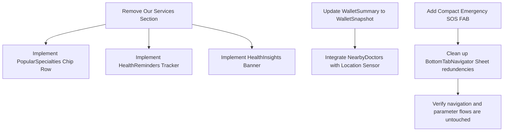

# HealthSync Home Screen Experience Audit

**Role:** Senior Product Designer Cluster (Joint Task Force: Practo, Apollo 24/7, Tata 1mg, Headspace, & Google Material Design)  
**Date:** 2026-06-01  
**Status:** 🔍 Pre-Implementation Review Complete

---

## 1. Executive Summary & Design Critique

The current home screen of HealthSync suffers from redundant service entry points, cognitive overload, and spacing deficiencies. By providing both a prominent "Our Services" grid and a floating center tab action button that launches the exact same flow, the app violates one of the core principles of interface design: **a single, clear, and unambiguous path to key actions**. 

### Critical Issues Identified:

1. **Functional Duplication:**
   * The "Our Services" grid contains: *Book Clinic*, *Video Consult*, *Lab Tests*, *Reports*, *Medicines*, and *Emergency SOS*.
   * The center Tab navigation button ("Book" floating button) opens a sheet with *exactly* the same options.
   * This wastes up to **35% of the primary fold height** on the Home screen for features that are already accessible globally from the floating bottom navigation bar.

2. **Dashboard Clutter:**
   * A lack of personalization means the patient is greeted with generic health tips and standard list layouts rather than contextual suggestions.
   * The "Wallet Summary" acts as a passive container rather than a rewarding/insightful dashboard widget.
   * No clear emergency rapid-access exists for high-stress situations. Relying on opening a bottom sheet to find the "Emergency SOS" action is a critical safety failure in life-threatening scenarios.

3. **Material 3 Alignment Gaps:**
   * Layout hierarchy uses hard cards instead of organic elevation and tonal surfaces.
   * Spacing lacks standard 8dp spacing grids, causing elements to feel compacted or arbitrarily padded.
   * Empty states and loading skeletons are absent, resulting in layout shifts during API fetches.

---

## 2. Competitive Philosophy Mapping

To resolve these issues, we draw design principles from the leading healthcare and wellness platforms:

| Brand | Key Philosophy | Application to HealthSync Redesign |
| :--- | :--- | :--- |
| **Practo** | *Direct Care Discovery* | Search-centric entry and location-based local doctor suggestions ("Nearby Doctors"). |
| **Apollo 24/7** | *Instant Medical Response* | High-priority upcoming appointments, urgent emergency quick actions, and seamless slot bookings. |
| **Tata 1mg** | *Healthcare Wallet & Retail Integration* | Rewarding loyalty points, micro-savings tracking, and clear diagnostic snapshots. |
| **Headspace** | *Calming Ambient Aesthetics* | Glassmorphism card layouts, soft rounded shapes, and personalized health insights that build trust and calm. |
| **Google Material Design (M3)** | *Tonal Cohesion & Accessibility* | Dynamic coloring, responsive container shapes (medium/large cards), and micro-animations for transitions. |

---

## 3. Structural Comparison: Current vs. Target

```
   Current Home Screen Layout             Target Home Screen Layout (Unified)
┌─────────────────────────────────┐      ┌─────────────────────────────────┐
│ [Greeting & Profile Icon]       │      │ [Greeting & Profile Icon]       │
├─────────────────────────────────┤      ├─────────────────────────────────┤
│ [Search Bar (Doctors/Clinics)]  │      │ [Search Bar (Doctors/Clinics)]  │
├─────────────────────────────────┤      ├─────────────────────────────────┤
│ [Location (📍 Suburb, City)]    │      │ [Location (📍 Suburb, City)]    │
├─────────────────────────────────┤      ├─────────────────────────────────┤
│ [Upcoming Appointment Card]     │      │ [Upcoming Appointment Card]     │
├─────────────────────────────────┤      ├─────────────────────────────────┤
│ [OUR SERVICES (6 Grid Cards)]   │ ───► │ [HEALTH REMINDERS (Med/Lab/Fol)]│
│  - Book Clinic  - Video Consult │      ├─────────────────────────────────┤
│  - Lab Tests    - Reports       │      │ [HEALTH INSIGHTS CARD (Calming)]│
│  - Medicines    - Emergency SOS │      ├─────────────────────────────────┤
├─────────────────────────────────┤      │ [POPULAR SPECIALTIES (Chips)]   │
│ [Recommended Doctors (List)]    │      ├─────────────────────────────────┤
├─────────────────────────────────┤      │ [NEARBY DOCTORS (Map Context)]  │
│ [Wallet Summary (Balance Only)] │      ├─────────────────────────────────┤
├─────────────────────────────────┤      │ [WALLET SNAPSHOT (Rewards/Bal)] │
│ [Health Tips (Scrollable list)] │      ├─────────────────────────────────┤
└─────────────────────────────────┘      │ [🚨 EMERGENCY SOS Floating CTA] │
          [➕ BOOK TAB]                  └─────────────────────────────────┘
                                                   [➕ BOOK TAB (ONLY launcher)]
```

---

## 4. UX/UI Section-by-Section Deconstruction

### 1. Health Insights Card
* **Design Pattern:** Medium-elevated Material 3 card using a premium gradient matching the time of day or symptom history.
* **Content:** Personalized wellness guidance (e.g., "Good afternoon, Souvik. Remember to walk for 10 minutes to maintain your target heart rate.").
* **Interactivity:** Subtle hover/tap scaling and a "Save/Read" micro-action.

### 2. Health Reminders (Medication, Follow-up, Lab Tests)
* **Design Pattern:** A sleek horizontal list of horizontal action cards.
* **Content:** 
  * *Medication:* "Dolo 650mg - Next dose at 2:00 PM" with a quick "Mark as Taken" checkbox.
  * *Follow-up:* "Review with Dr. Sharma in 2 days" with a fast-book slot action.
  * *Lab Test:* "Fasting Blood Sugar test due tomorrow" with home-pickup scheduler.
* **Aesthetic:** High tonal contrast, clean typography, and micro-interaction states.

### 3. Popular Specialties
* **Design Pattern:** A 2x3 grid or horizontal scroll of circular Material 3 chips with custom illustrations/emojis.
* **Items:** Cardiology (❤️), Dental (🦷), Pediatrics (👶), Orthopedics (🦴), Dermatology (🧴).
* **Action:** Tapping directly opens `DoctorSearch` pre-filtered by that specialization.

### 4. Nearby Doctors
* **Design Pattern:** Horizontal card slider showcasing local clinic availability, leveraging detected GPS location.
* **Content:** Doctor cards containing exact distance (e.g., "1.2 km away"), clinic branch name, next available slot timing (e.g., "Available today, 3:30 PM"), and direct navigation to their unified profile.

### 5. Wallet Snapshot
* **Design Pattern:** Sleek glassmorphic card utilizing metallic/dark gradients with a double metrics readout.
* **Metrics:** 
  * Left: Wallet Balance (`₹X,XXX.XX`) with a quick top-up shortcut.
  * Right: Reward/Loyalty Points (`XXXX pts`) with a visual progress indicator showing proximity to the next free consultation tier.

### 6. Emergency Quick Action
* **Design Pattern:** A high-visibility, compact floating action button (FAB) positioned near the bottom right, styled in primary Warning/Error red with a pulse border effect.
* **Action:** Direct, single-tap confirmation sheet to dispatch ambulance and notify emergency contacts. This completely removes it from the navigation noise.

---

## 5. Spacing, Typography & Material 3 Specs

* **Color Palette:** Ambience colors from colors.js (dark ambient background `#0A0E17`, backgroundCard `#1A1F2E`). We will apply secondary premium purples (`#6C5CE7`) and clean brand teals (`#00D4AA`) for balance.
* **Typography Hierarchy:**
  * Display headers: `Inter-Bold`, size 22, tracking -0.5dp.
  * Section titles: `Inter-Bold`, size 16, tracking 0.
  * Subtext / Meta descriptors: `Inter-Regular`, size 11, color `textSecondary`.
* **Margins:** Strict 16dp horizontal page margins, with 12dp internal card margins and 8dp spacing grids between elements.
* **Loaders:** Skeleton loaders mimicking the structure of "Reminders" and "Nearby Doctors" cards while data fetches.

---

## 6. Execution & Verification Flowchart


