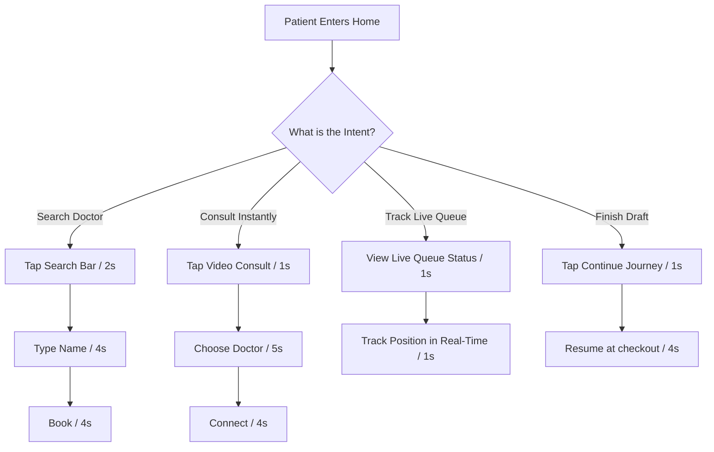

# HealthSync V3 Home Screen Strategic Design Review

**Role:** Senior Product Designer Cluster (Joint Task Force: Practo, Apollo 24/7, Tata 1mg, Headspace, & Google Material Design)  
**Date:** 2026-06-01  
**Status:** 🔍 Pre-Implementation Review Approved (Strategic Refinements Integrated)

---

## 1. Executive Strategy & Hierarchy Audit

In response to the transition from a wellness/fitness app to a high-utility **healthcare transaction & booking platform**, the home screen layout is restructured to achieve a **10-second completion time** for critical workflows. 

Every pixel is optimized around:
* **Booking:** Direct, high-intent entry points.
* **Appointments & Queue Tracking:** Immediate feedback on active, waiting consultations.
* **Transaction Continuity:** Single-tap resumption of pending states.

### Final Screen Hierarchy:
```
┌──────────────────────────────────────────┐
│ 1. Header (Greeting & Profile Avatar)    │
├──────────────────────────────────────────┤
│ 2. Search & Geo-Location pill            │
├──────────────────────────────────────────┤
│ 3. Quick Book Actions (Hero Cards)       │
│    - Book Doctor    - Video Consult      │
├──────────────────────────────────────────┤
│ 4. Live Queue Status (Conditional)       │
│    - Render only for confirmed + waiting │
├──────────────────────────────────────────┤
│ 5. Continue Journey (Conditional)        │
│    - Render only if pending items exist  │
├──────────────────────────────────────────┤
│ 6. Available Now (Horizontal Row)        │
│    - Tonal cards, green online badge     │
├──────────────────────────────────────────┤
│ 7. Recommended Doctors (Horizontal Row)  │
├──────────────────────────────────────────┤
│ 8. Trending Specialties (Compact Chips)   │
├──────────────────────────────────────────┤
│ 9. Secondary Services (Lab/Meds/SOS)     │
├──────────────────────────────────────────┤
│ 10. Wallet Snapshot (Tonal M3 card)      │
└──────────────────────────────────────────┘
```

---

## 2. 10-Second Flow Map (Core Workflows)



---

## 3. Section UX Specifications

### 1. Quick Book Actions
* **UX Objective:** Instantly capture the patient's primary intent (Physical Clinic visit vs. Virtual Telemedicine).
* **Booking Action 1:** **Book Doctor** -> Navigates directly to `DoctorSearch` to find available practitioners.
* **Booking Action 2:** **Video Consult** -> Navigates to `VideoConsult` for on-demand virtual consultations.
* **Styling:** Two side-by-side Material 3 cards with secondary accent gradients and spring-scaling touch targets.

### 2. Live Queue Status (Conditional)
* **UX Objective:** Real-time reassurance and tracking.
* **Condition:** Renders **only** when the user has a confirmed appointment for *today* with a `waiting` queue status. Hides completely otherwise to save screen space.
* **Content:** Doctor, next slot, wait time, live position progress indicator, and active consultation number.

### 3. Continue Journey (Conditional)
* **UX Objective:** Recover lost booking completions and payments.
* **Condition:** Renders **only** if the API reports pending checkouts, unpaid appointments, or incomplete consultations.
* **Content:** Compact horizontal scrolling cards.

### 4. Available Now Section
* **UX Objective:** Instant gratification and immediate bookings.
* **Content:** Horizontal scroll of doctors who are currently active and taking consultations *right now*.
* **Visuals:** Features a vibrant green "Available Now" indicator badge, next slot timing, rating, and fee.

### 5. Trending Specialties
* **UX Objective:** Quick categorical filtering.
* **Content:** Ultra-compact horizontal row of scrollable Material 3 chips (Cardiology, Dental, Pediatrics, Orthopedics, Dermatology). No heavy icons or description blocks.

### 6. Secondary Services
* **UX Objective:** Rapid discovery of support utilities.
* **Items:** Lab Tests, Pharmacy/Medicines, Medical Reports, Emergency SOS.
* **SOS Context:** Relocated from a floating state to this section (and in the Book Menu sheet) to keep it secondary yet easily locatable.

---

## 4. Implementation Checklist

- [ ] Remove all wellness components: `HealthScoreCard.js`, `HealthInsights.js`, `HealthReminders.js`.
- [ ] Create `QuickBookActions.js` with "Book Doctor" and "Video Consult".
- [ ] Create `LiveQueueStatus.js` (conditional queue tracking widget).
- [ ] Create `AvailableNow.js` (available doctor search row).
- [ ] Create `SecondaryServices.js` (labs, meds, records, SOS).
- [ ] Update `PopularSpecialties.js` to `TrendingSpecialties.js` (inline chips).
- [ ] Modify `ContinueJourney.js` to return `null` if list is empty.
- [ ] Adjust `HomeScreen.js` to tie all components together in progressive rendering tiers.
