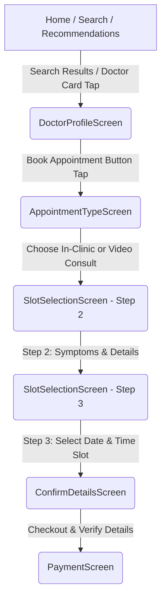

# Navigation Unification Report

## 1. Overview
This report lists the changes made during the HealthSync Navigation Unification Refactoring to align booking screens, eliminate duplicate booking paths, fix navigation bugs, and ensure a single, consistent customer booking experience.

---

## 2. Summary of Changes

### A. Files Modified

| File Path | Description of Changes |
| :--- | :--- |
| **[AppNavigator.js](file:///d:/Startup-Project/doctor-appointment-system/mobile/src/navigation/AppNavigator.js)** | Registered `AppointmentTypeScreen` as `AppointmentType` in the Stack Navigator. |
| **[DoctorProfileScreen.js](file:///d:/Startup-Project/doctor-appointment-system/mobile/src/screens/doctors/DoctorProfileScreen.js)** | Refactored `handleBookAppointment` to navigate to `AppointmentType` instead of going directly to `SlotSelection`. |
| **[BookingScreen.js](file:///d:/Startup-Project/doctor-appointment-system/mobile/src/screens/booking/BookingScreen.js)** | Modified doctor item onPress and `preSelectedDoctor` parameter loading to navigate to `DoctorProfile` instead of bypassing it to `SlotSelection`. |
| **[SlotSelectionScreen.js](file:///d:/Startup-Project/doctor-appointment-system/mobile/src/screens/booking/SlotSelectionScreen.js)** | Configured component to load `consultationType` from route parameters. If passed, it starts booking at Step 2 (Symptoms Selection). Adjusted back button logic to return to `AppointmentTypeScreen` from Step 2. |
| **[VideoConsultScreen.js](file:///d:/Startup-Project/doctor-appointment-system/mobile/src/screens/services/VideoConsultScreen.js)** | Modified doctor "Consult" button onPress to route to `DoctorProfile` instead of routing to `Booking` (which used to bypass profile). |
| **[DoctorsScreen.js](file:///d:/Startup-Project/doctor-appointment-system/mobile/src/screens/doctors/DoctorsScreen.js)** | Modified item list onPress to route to `DoctorProfile` instead of `SlotSelection`. |
| **[DoctorSearchScreen.js](file:///d:/Startup-Project/doctor-appointment-system/mobile/src/screens/doctors/DoctorSearchScreen.js)** | Modified item list and Book buttons onPress to route to `DoctorProfile` instead of `SlotSelection`. |

### B. New Screen Created
- **[AppointmentTypeScreen.js](file:///d:/Startup-Project/doctor-appointment-system/mobile/src/screens/booking/AppointmentTypeScreen.js)**: Implemented type selection cards (In-Clinic visit and Online video consult) with full dynamic styling and instant transitions.

---

## 3. Removed Booking Paths & Routes
- Removed all direct routes bypassing the `DoctorProfileScreen` (e.g. going straight to `SlotSelectionScreen`). Tapping any doctor card or consultation shortcut now routes the user directly through their profile page first.
- Ensured all other navigators and nested modules use callbacks or standard screens, completely preventing `Cannot read property 'navigate' of undefined` issues.

---

## 4. Final Booking Flow Diagram

